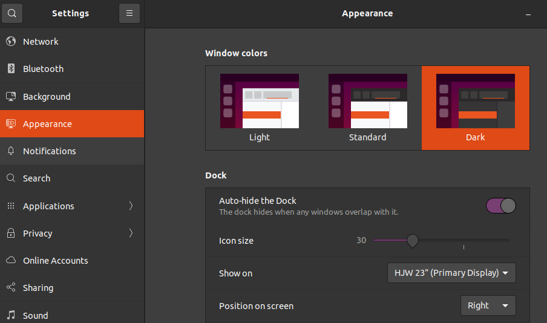
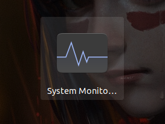
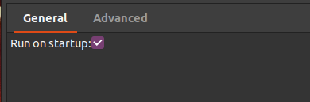
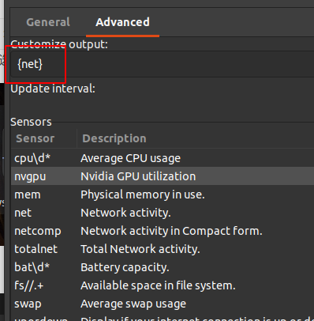
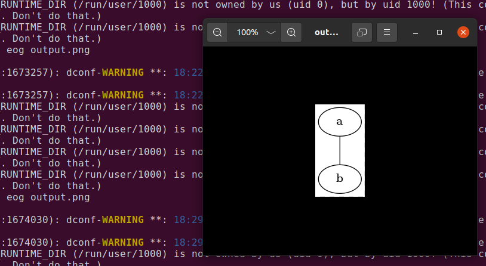

# 1. ubuntu wine 微信中文乱码

修改文件
/opt/deepinwine/tools/run.sh
/opt/deepinwine/tools/run_v2.sh
将WINE_CMD那行中加入LC_ALL=zh_CN.UTF-8

```bash
WINE_CMD="LC_ALL=zh_CN.UTF-8 deepin-wine"
```
参考
https://gitee.com/wszqkzqk/deepin-wine-for-ubuntu


# 2. ubuntu 20.04 wine 微信 qq 截图时黑屏

之前截图都是好的的，不知道为什么，今天截图时，点击了微信的截图按钮后，屏幕除了状态栏，都变成黑色的了。

各种搜索引擎搜了一遍，没有发现解决方案。

最后决定思考最近对系统做了什么变更，最近我好像给系统安装了新的主题，然后在登录时，选择了新的主题，而没有选择默认的ubuntu主题。

在登录界面的右下角，有个按钮，点击之后，可以选择主题。

最近我都是选择其他的主题，没有选择默认的ubuntu主题，然后我就注销之后，重新在登录时选择默认的ubuntu主题后，再次打开微信截图，功能恢复正常。

所以说，既然选择ubuntu了，就没必要搞些花里胡哨的东西。ubuntu默认的主题挺好看的，而且支持自带主题的设置，就没必要再折腾了。




# 3. [open] ubuntu 20.04 锁屏后 解锁屏幕非常慢

super + l可以用来锁屏，锁屏之后屏幕变成黑屏。

黑屏之后，如果需要唤醒屏幕，可以随便在键盘上按键，去唤醒屏幕。但是这个唤醒的过程感觉很慢，基本上要随便按键接近十几秒，屏幕才能被点亮，网上搜了下，但是没有找到原因。

但是有个解决办法，就是在黑屏状态下，不要随便输入，而要输入正确的密码，然后按回车键， 这样会快很多。

也就是说，系统运行正常，可能是显示器的问题。

# 4. ubuntu 20.04 xorg 高cpu 桌面卡死

```bash
sudo systemctl restart gdm
```

# 5. ubuntu 状态栏显示网速

```bash
sudo add-apt-repository ppa:fossfreedom/indicator-sysmonitor 
sudo apt-get install indicator-sysmonitor
```

在任务启动中选择System Monitor




在配置中可以选择开机启动



在高级中可以设置显示哪些列， 我只关系网速，所以只写了{net}




# 6. 在命令行查看图片

实际上终端并不能显示图片，而是调用了外部的程序取显示图片。

eog 是 Eye Of Gnome 的缩写， 它其实是个图片查看器。

```
eog output.png
```




# 7. build-requirements: libtool not found.

```
apt-get update
apt-get install -y libtool-bin
```

# 8. ubuntu下解压zip文件出现中文乱码

相信大家在使用Ubuntu等linux系统时经常会遇到解压压缩文件出现乱码。
zip的处理方式主要有以下两种

一、unzip
解压时-O指定字符编码
```
unzip -O GBK xxxx.zip
```
注：解压很复杂的中文名文件称如果报错，用引号括起来即可

二、unar
```
unar xxx.zip
```
注：这种方式要先保证系统中有安装unar，若没有使用如下命令安装：
`sudo apt-get install unar`


# 9. 放弃ubuntu的GUI

选择linux的原因无非是丰富的开发软件包，各种个样的效率工具，而不是因为漂亮的GUI。

我使用ubuntu大概已经有有几个月了，说说一些使用体会。

- 聊天软件： 微信、QQ等工，目前只有wine版，使用体验会稍微比mac和window有些差，但是基本是可用。
- 输入法：搜狗输入法，基本上和win和mac没有什么差别
- 文档: wps 基本上和win和mac没有区别
- 浏览器: chrome, firefox体验始终丝滑
- 编辑器：neovim 畅享丝滑
- 各种开发工具：git, docker, oh my zsh tmux 等等， 这些天然就是linux下面的工具

总体来说，如果没有最近遇到的两个严重问题，我会一直用ubuntu下开发的。

1. xorg经常cpu很高，导致界面卡死，出现频率很高，查了很多资料，依然无法解决。只能通过restart gdm3去重启。
2. 有时候xorg cpu不算高，也查不出高cpu的进程，但是整个界面还是卡死

卡死的这个问题真的非常影响开发效率。

所以我决定关闭ubuntu的图形界面，通过ssh链远程接，在上面做开发

# 10. ubuntu 终端还是图形界面

ubuntu boot最后阶段，进入到登录提示。

这里有两个选择
1. 图形界面
2. tty终端

具体是进入哪种显示方式，是由配置决定。但是默认的是图形界面。

```bash
# 终端启动
systemctl set-default multi-user.target
# 图形界面启动
systemctl set-default graphical.target

设置之后reboot
```

# 11. 如何从GUI进入到终端模式呢？

某些时候，ubuntu图形界面卡死，无法交互。如何进入终端模式使用top命令看看什么在占用CPU呢？

有以下快捷键可以从GUI切换到tty

- Ctrl + alt + f1
- Ctrl + alt + f2
- Ctrl + alt + f3
- Ctrl + alt + f4
- Ctrl + alt + f5
- Ctrl + alt + f6

上面的快捷键都可以进入终端，如果一个不行，就用另一个试试。注意 ctrl alt f功能键 要同时按下去。

我之前就遇到过，图形界面卡死，无法操作。然后进入终端模式，使用top命令，看到xorg占用了接近100%的CPU.

然后输入下面的命令来重启gdm来解决的

```
sudo systemctl restart gdm
```

# 12. 什么是GDM?
GDM是gnome display manager的缩写。

```
# 查看gonme版本号
gnome-shell --version
```

常见的gdm有
- gdm3
- lightdm
- ssdm

通过查看/etc/X11/default-display-manager可以查看系统使用的gdm具体是哪个

```
➜  ~ cat /etc/X11/default-display-manager
/usr/sbin/gdm3

也可以通过下面的方式查看
systemctl status display-manager
```


```
# 可以通过下面的方式安装不同的gdm

sudo apt install lightdm
sudo apt install sddm

# 通过dpkg-reconfigure 可以来配置使用不同的GDM

sudo dpkg-reconfigure gdm3
sudo dpkg-reconfigure lightdm
sudo dpkg-reconfigure sddm
```

# 13. ubuntu截图软件flameshot

```
apt install flameshot
```

# 14. 生命不息 折腾不止 使用ubuntu作为主力开发工具

最初，我花了6年时间在windows上学习、娱乐、编码

后来我花了4年时间转切换到macbook pro上开发

现在，我切换到ubuntu上开发。

我花了很长的时间，走过了人生的大半个青葱岁月的花样年华

才学会什么是效率，什么是专一。

蓦然回首

这10年的路，每次转变的开始都是感觉镣铐加身，步履维艰，屡次三番想要放弃

内心深处彷佛有人在说，你为什么要改变呢？ 之前的感觉不是很好吗？

你为什么要这么折腾呢？

有一种鸟儿注定不会被关在牢笼里，因为它的每一片羽毛都闪耀着自由的光辉。--《肖申克的救赎》

改变，的确是让人不舒服的事情。

说实话，刚开始在ubuntu上开发，连装个中文输入法都让我绝望的想要放弃。

还好是IT行业，你路过的坑，肯定有前任踩过。

说来有点搞笑，我在ubuntu上使用vscode时，居然感觉不习惯了。

我不习惯写着写着代码，还要把手从键盘上移开，去寻找千里之行的鼠标，然后滑动、点击、一直不停歇

然后我就切换回neovim。

有人说：vim是跟得上思维速度的编辑器。只有真正使用过的人，才能理解这句话。

当你每次想向上飞的时候，总会有更大的阻力。


# 15. 最后的最后 我用的deepin

- 如果我只用终端，连上linux做开发，那么我最好的选择是ubuntu或者manjaro
- 但是我还是避免不了要用微信，腾讯会议等App，我又想用linux, 那最好的选择是deepin

**可能是人老了，不想再折腾了**