一年过半以后，偶然打开微信公众号，看到草稿箱里的篇文章。我才回想起去年带女友去西安的那个遥远的夏天。

如今女友已经变成老婆，这篇文章我才想起来发表。

# day 1 钟楼 鼓楼 回民街

那是六月末的时候，和女友一起坐火车去了趟西安。

为什么要去西安呢？据吃货女友说，西安有非常多的好吃的。所以人生是必须要去一趟的。

清晨，我们从南京南站出发坐动车，一路向西，坐了5个多小时，到达西安北站。

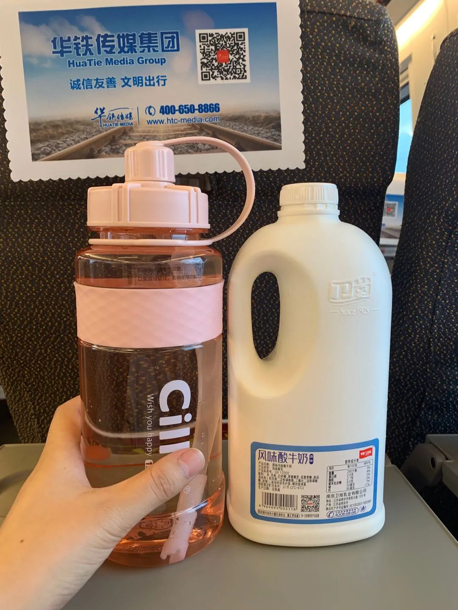

路上我带了一个1500ml的水瓶，以及1500ml的酸奶。

女友吐槽说，还好没做飞机，不然我就像宝强一样，要在机场干完一大瓶酸奶了。

下了动车，立即前往钟楼订的宾馆，放置行李。

西安钟楼位于西安市中心，是中国现存钟楼中形制最大、保存最完整的一座。建于明太祖洪武十七年，初建于今广济街口，与鼓楼相对，明神宗万历十年整体迁移于今址。

沿着钟楼附近，我们逛了一圈回民街。

回民街是西安著名的美食文化街区，是西安小吃街区。

西安回民街作为西安风情的代表之一，是回民街区多条街道的统称，由北广济街、北院门、西羊市、大皮院、化觉巷、洒金桥等数条街道组成，在钟鼓楼后。

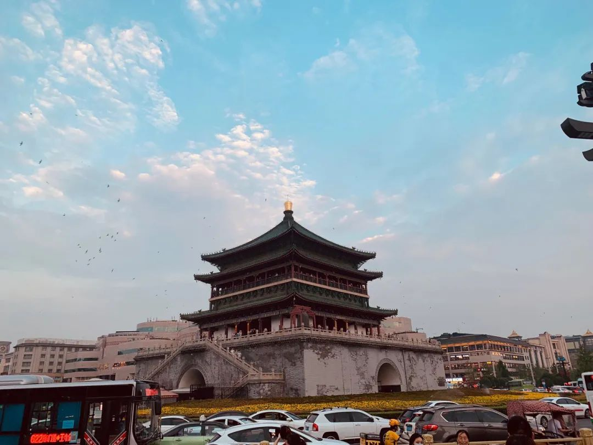

钟楼

# day 2 大唐芙蓉城 大唐不夜城 大雁塔

大唐芙蓉城是一座仿唐建筑，里面有许多景点，或许我们不应该早上来，因为上午太热了。

唯一庆幸的是，我们带了一个很大的水杯，而且芙蓉城里提供免费的开水，所以我们才没有被渴死。

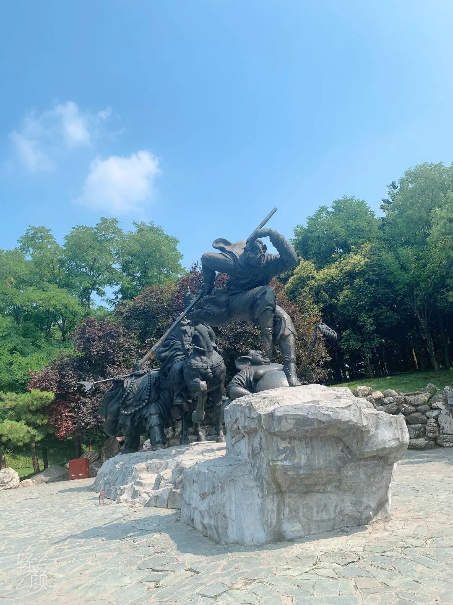

大唐芙蓉城 西游师徒四人 雕塑

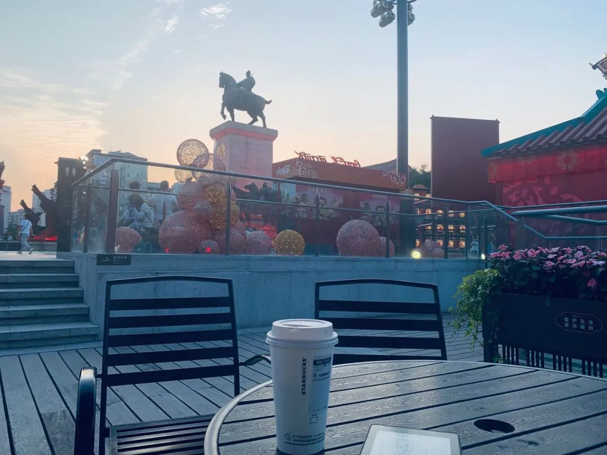
傍晚的 大唐不夜城

夜幕降临的 大唐不夜城

遗憾之一：大雁塔没有去看，因为当时正在维修，周围全是脚手架。
遗憾之二：没有到陕西历史博物馆看看，因为没有早点预约

女友埋怨我说我不早点做攻略，害得这么多景点去不了。

我说我是做了攻略的，还记在备忘录里面呢。

女友打开我的备忘录一看，笑出眼泪说：你做的啥狗屁攻略，就这几个字！男人果然靠不住！

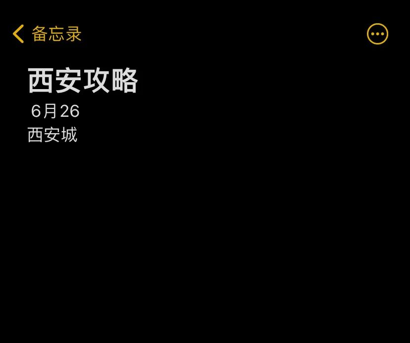

我说: 这你就不懂了吧，啥都写清楚，一个一个点打卡多没意思。

# day3 华清宫 兵马俑 长恨歌

由于西安攻略做的太过肤浅，所以第二天晚上决定直接跟团。在网上买了两张华清宫兵马俑和长恨歌的一日游。

说实在的，华清宫没啥意思，都是洗澡池子。

蒋介石洗过澡的池子，杨贵妃的洗澡池子，唐明皇的洗澡池子，大臣们的洗澡池子。

逛完之后，下午我们坐着旅游大巴，前往兵马俑。

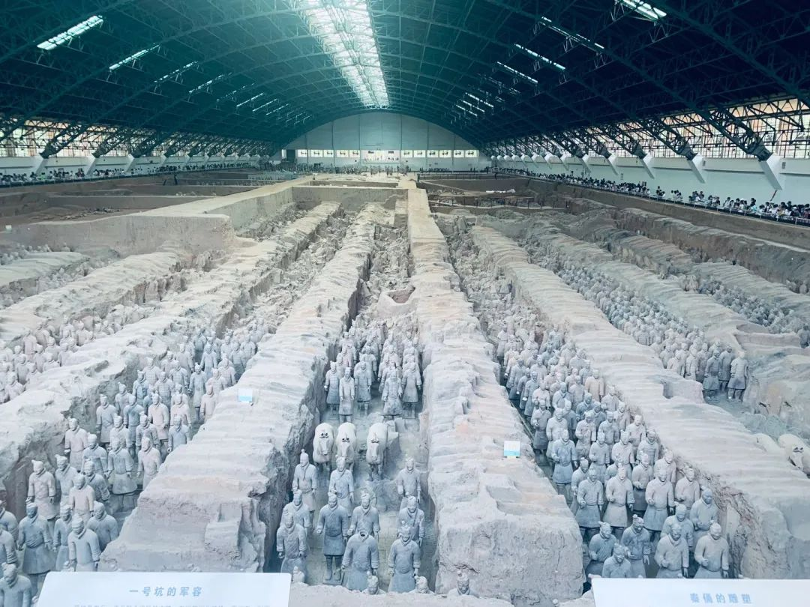
一号坑

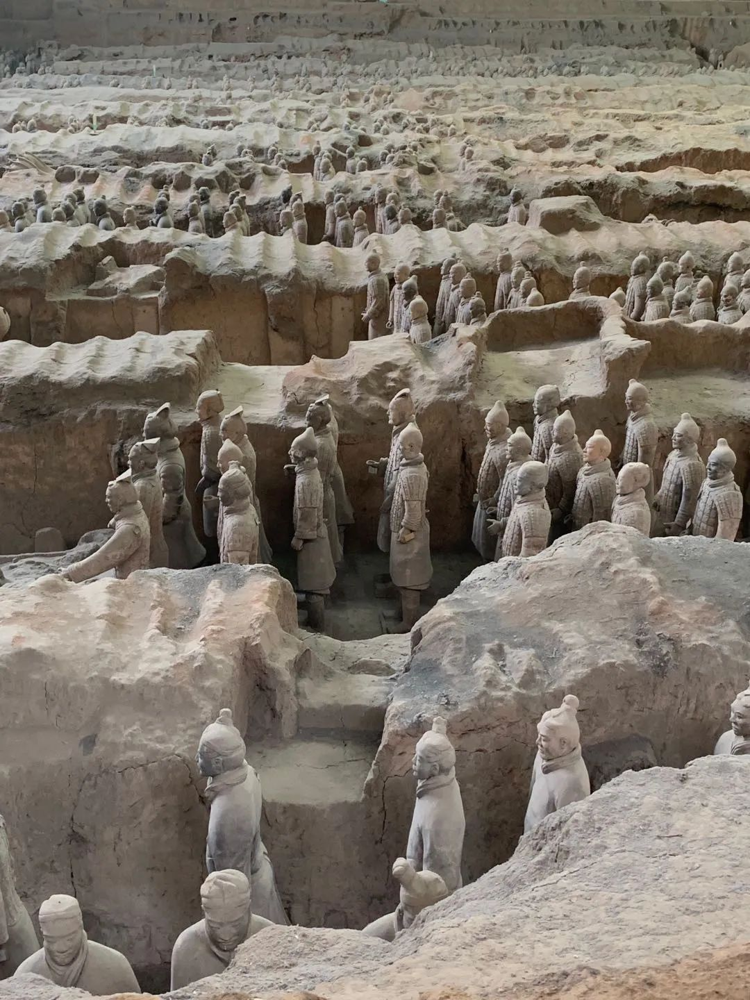
一号坑

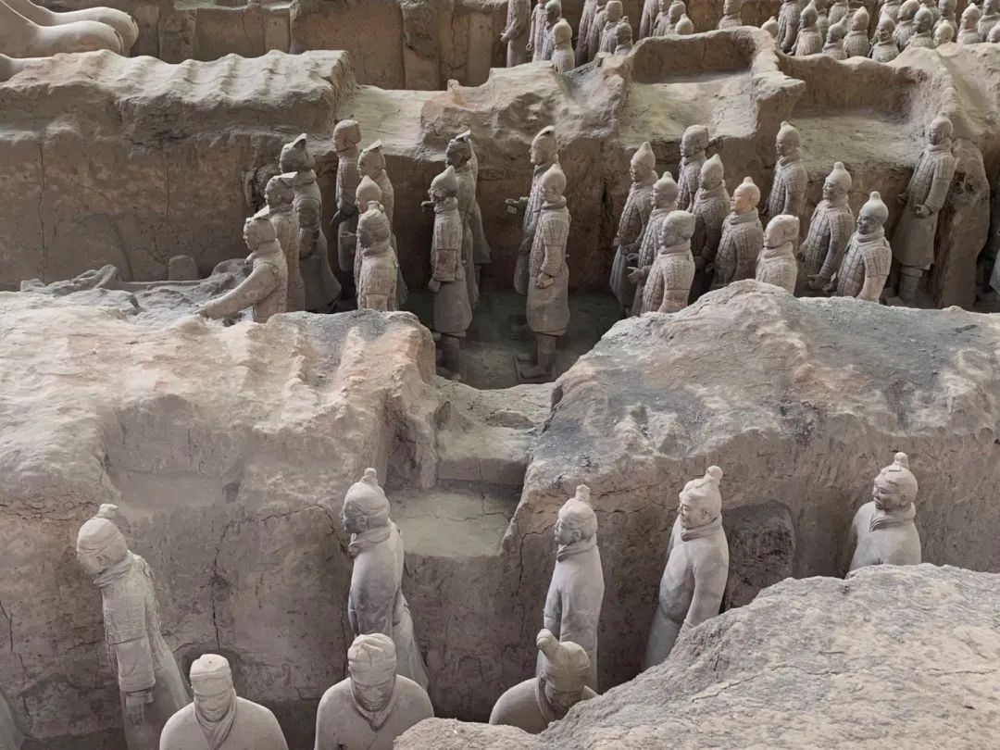
一号坑

一号坑

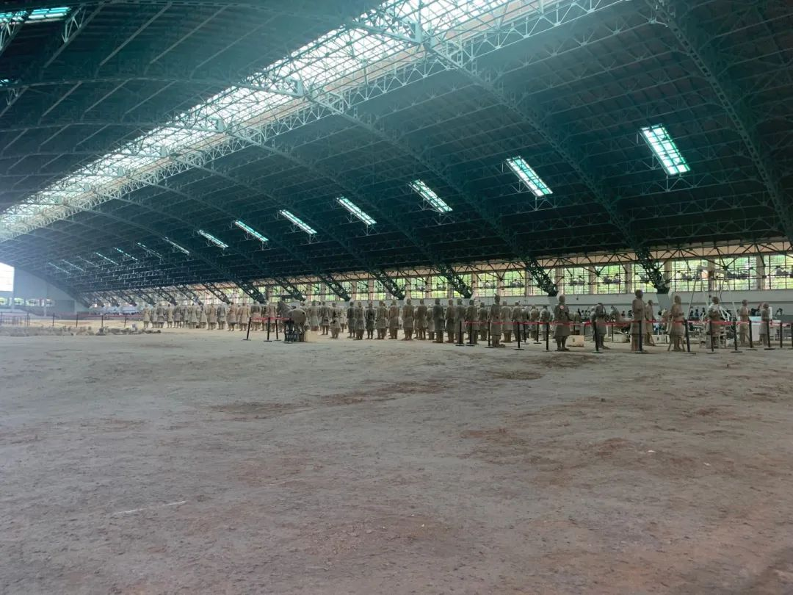
一号坑

兵马俑有三个坑。

一号坑最大，兵马俑也是最多的。然而当时游客比肩接踵，加上天气炎热，大家都在里面像蒸桑拿一样。

出了一号坑，我心里想：这么大个坑，这么热为啥不装空调，难道是因为要保护文物吗？

后来据博物馆的讲解员介绍：不装空调是因为审核手续复杂，可能要要个几十年手续才能完成。像二号坑和三号坑都已经装好空调了。

二号坑真的是个坑，没有兵马俑，仅仅是个大坑。

三号坑比较小，仅有几个陶俑。

长恨歌实际上是一个大型的室外表演，由白居易的《长恨歌》演绎而来，讲述唐明皇和杨贵妃的爱恨情长。灯光绚丽，舞蹈优美，感人至深。

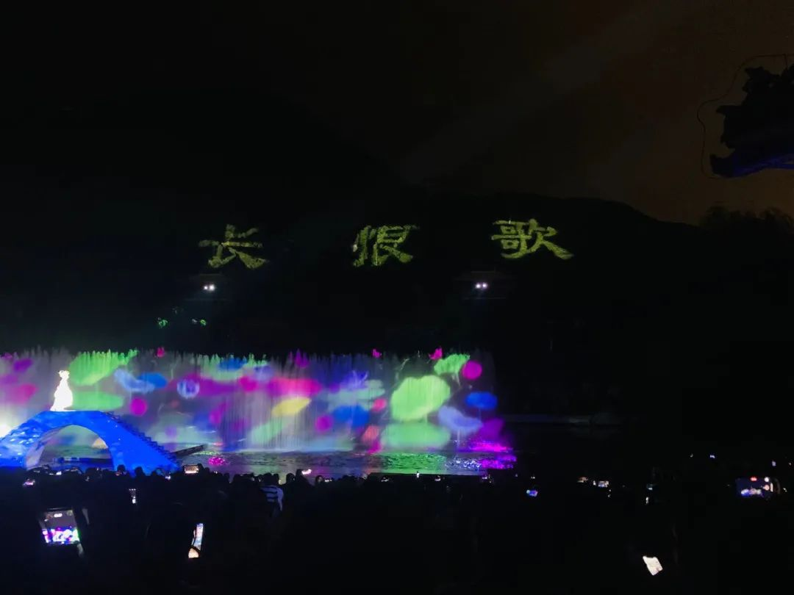

关于西安美食就很多了

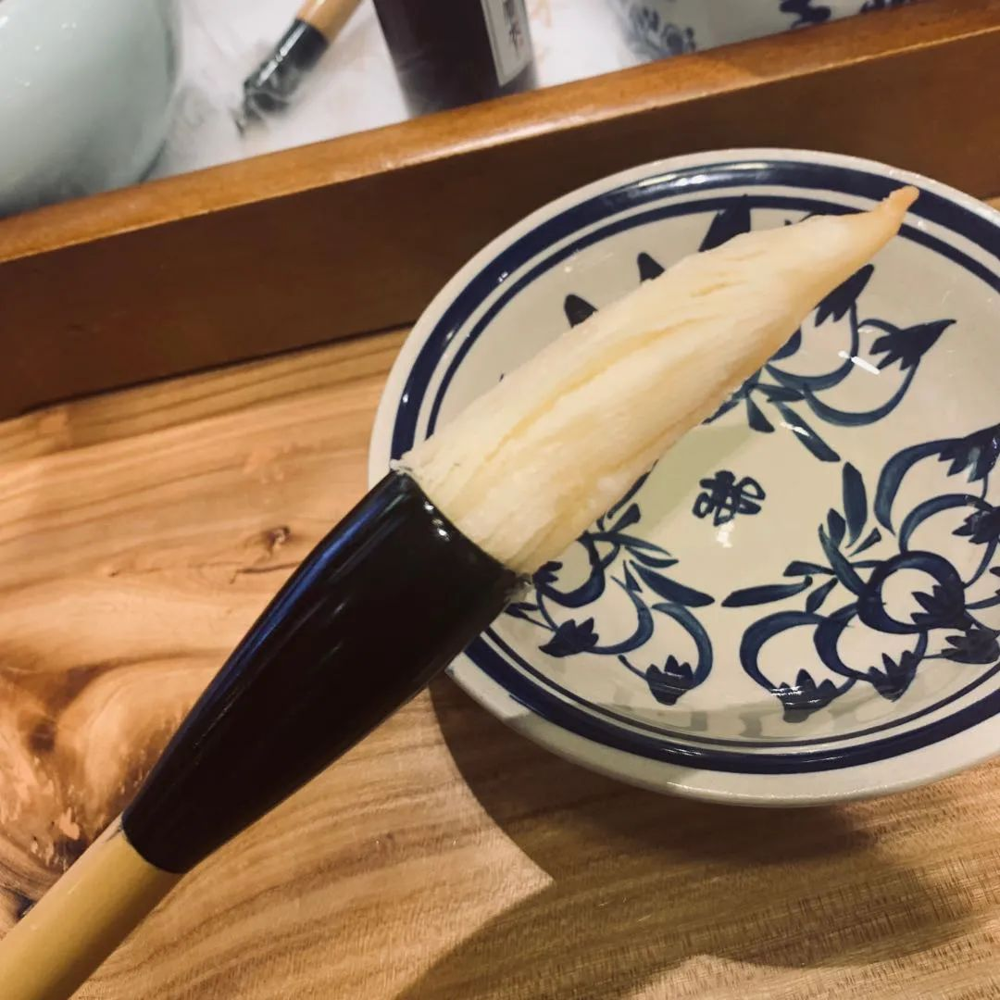
毛笔酥

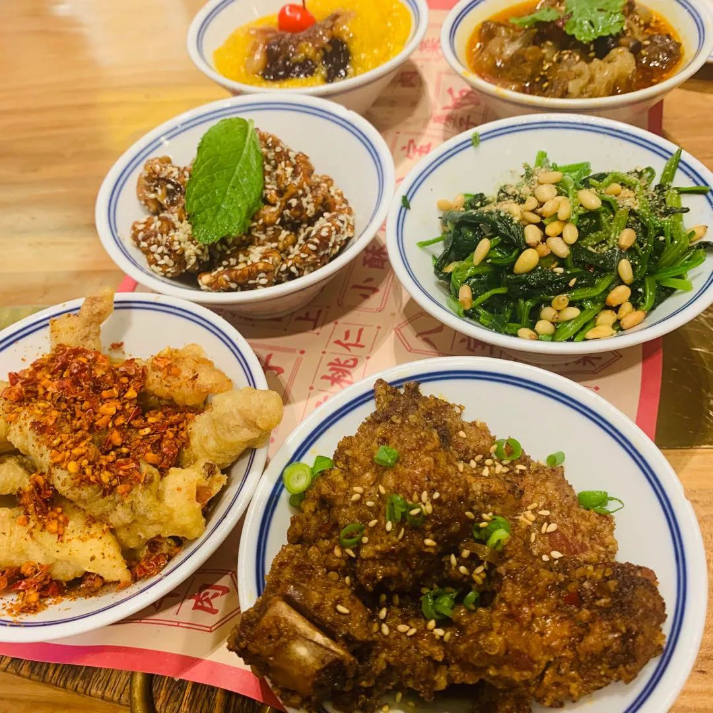
六大碗

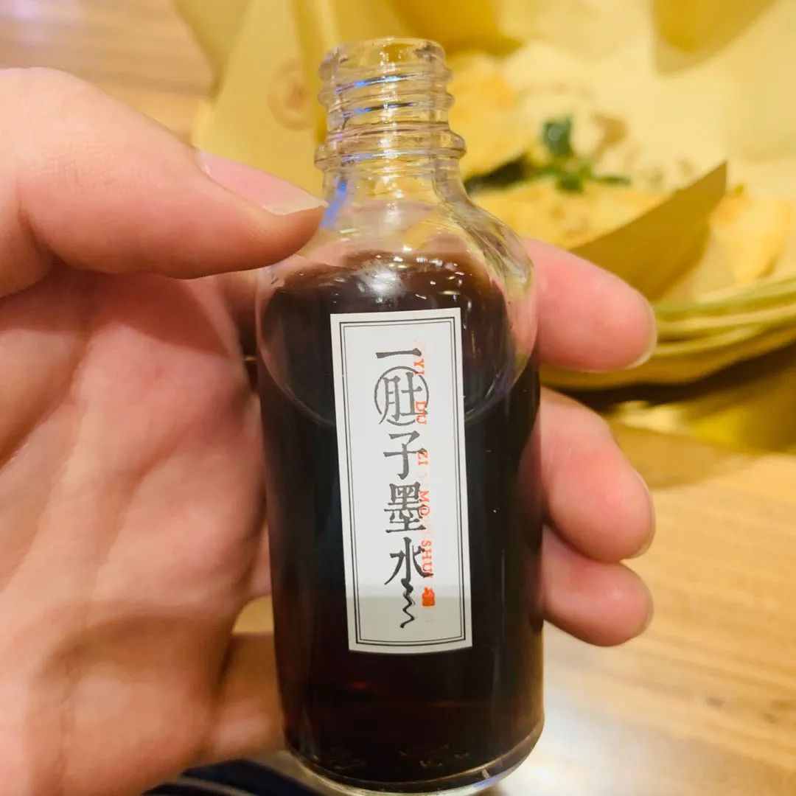
毛笔酥 酸梅汤