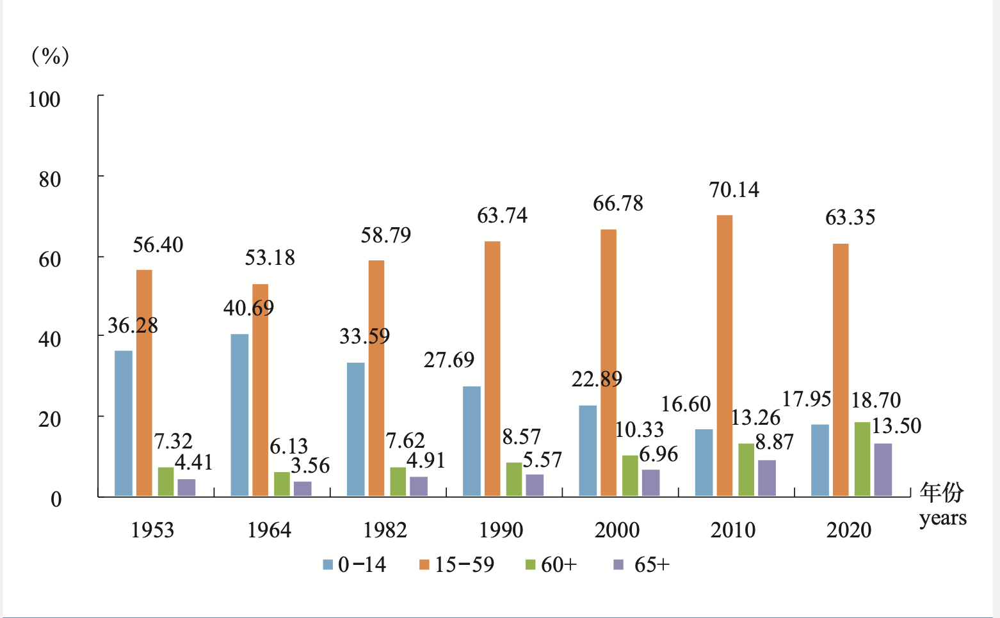

我以前看过一部电影，叫做[《入侵脑细胞》](https://movie.douban.com/subject/1293171/)，这部电影提供一种可能性。类似的电影还有《盗梦空间》，都是将一种思想植入别人的思想中。

这两部电影虽然提供了可能性，但是却无法提供实际可操作的方案。

最近在阅读的一本书也于此有关，叫做[《对不起，我操控了你的大脑》](https://book.douban.com/subject/35264809/)，是一个叫做剑桥分析、曾轰动世界的公司，利用基于大数据、算法、人工智能、心理学来做思想植入的。常见的领域如操纵大选，并且提供成功的案例。

但是作为普通人，大规模的思想植入似乎里我们还是比较遥远。

但是真的那么遥远吗？

昨天我爸来看我，之前他总是抱怨手机流量不够用。我给他换了每个月180G的流量卡，才过没两三天，他说已经用了20多G了。按照这个速度，180G的流量也不够用一个月。

我问：“你怎么会用那么多流量！，你用手机看视频的吗？”

爸说：“我经常刷抖音，刷好久，刷的眼疼”

我说：“你还是少刷点手机吧”，虽然这只是苍白无力的 一句关心。

我爸生于70年代，没怎么读过书，小学文凭。现在年近五十，经常带着鸭舌帽，依然遮不住后脑勺斑白的头发。虽然他经常用手机，但是很多东西依然搞不明白，需要找身边的年轻人来帮忙设置手机。

一个50多岁的人，人生过了大半。面对现在飞速发展的社会，很多东西都已经无法适应。对于他自己来说，也基本上无法改变自己。从第七次人口普查的数据中可以看出，在2020年60+的人口已经占比接近14亿人口的20%了，随着时间的推移，这个占比只会增大。

对于我爸这类的人，即使刷的眼睛疼，也无法控制自己，还是一直不停的刷。

由此可见，像这种大公司，制作的超级App有多可怕。能够一直持续的让大脑保持短期兴奋。这种超级App，背后都是心理学家、计算机学家、数据科学家等。 这些专家对待普通大众，就像哥伦布对待印第安人。

> 因为我发现他们没有什么信仰，也没有任何崇拜的形象，人们又都很温和，他们无邪得不知道什么是邪恶，从不侵害别人，也不懂得偷窃，没有打斗，特别的温顺  《哥伦布日记》

或许几十年以后，大部分人的大脑已经退化，也不需要有思考能里。只需要机械的按照刺激->反应去行动。

这种进化是一种潮流，绝大多数人都难以幸免。作为一个独立思考的人，我只能尽量避免被影响，远离社交网络。

