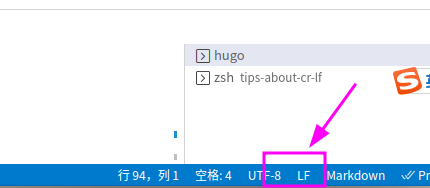
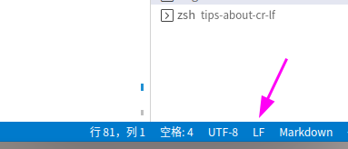
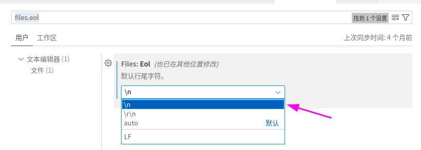

# CRLF

二进制	| 十进制 | 十六进制	| 八进制 | 字符/缩写 | 解释
--- | --- | --- | --- | --- | ---
00001010 | 10 | 0A	| 012 |  LF/NL(Line Feed/New Line)	| 换行键
00001101 | 13 | 0D	| 085 | CR (Carriage Return)	| 回车键

CR代表回车符，LF代表换行符。

这两个符号本身都是不可见的。

如果打印出来
- CR 会显示 `\r`
- LF 会显示 `\n`

# 不同系统的行结束符

- Linux系统和Mac换行符是 `\n`
- Windows系统的换行符是 `\r\n`


# 如何区分文件的换行符？

可以使用od命令

```
od -bc index.md
```

假如文件的原始内容如下

```
- 1
- 2
```

注意012是八进制的数，十进制对应的数字是10，也就是换行符。

```
0000000 055 040 061 012 055 040 062
          -       1  \n   -       2
0000007
```

如果用vscode打开文件，也能看到对应的文件格式，如LF。




# 换行符的的差异会导致哪些问题？

## shell脚本问题

如果bash脚本里包含CRLF,  可能导致脚本无法解析等各种异常问题。

例如下面的报错，docker启动shell脚本可能是在windows下编写的。所以脚本无法

```
standard_init_linux.go:211: exec user process caused "no such file or directory"
```

# 如何把windows文件类型转为unix?

```
# 可以把windows文件类型转为unix

dos2unix file
```

如果是vscode，也可以点击对应的文件格式按钮。



# 如何解决这些问题？

最好的方案，是我们把代码编辑器， 设置eol为`\n`， 从源头解决这个问题。

以vscode为例子：




- vscode的eol配置，只对新文件生效
- 如果文件本来就是CRLF， 需要先转成LF, eol才会生效
