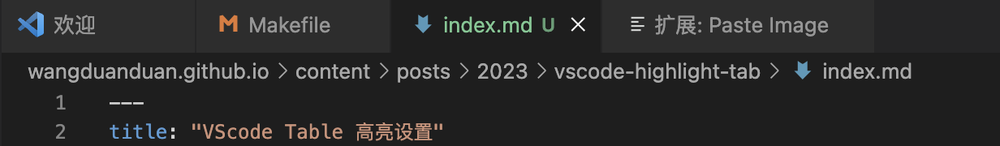
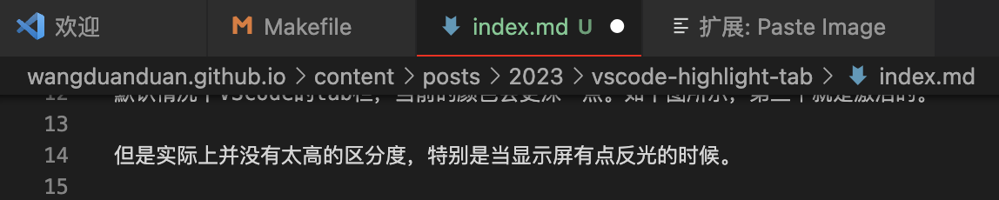

默认情况下VScode的tab栏，当前的颜色会更深一点。如下图所示，第三个就是激活的。

但是实际上并没有太高的区分度，特别是当显示屏有点反光的时候。



我想应该不止一个人有这个问题吧

看了github上，有个人反馈了这个问题，https://github.com/Microsoft/vscode/issues/24586


后面有人回复了

```json
"workbench.colorCustomizations": {
    "tab.activeBorder": "#ff0000",
    "tab.unfocusedActiveBorder": "#000000"
}
```

上面就是用来配置Tab边界的颜色的。

看下效果，当前激活的Tab下有明显的红线，是不是更容易区分了呢

