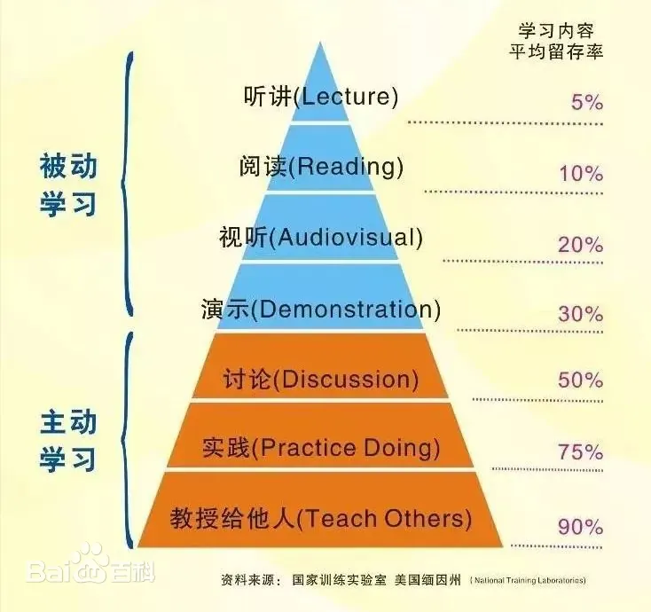

# 公开自己的错误

我在写博客时，有时候脑海里总会蹦出一个小人，面露鄙夷的脸色对我说：你写这么多没啥技术含量的垃圾，公开在网上，难道不怕暴露自己的无知吗？

说实话，我是有这样的担忧。

因为我是有自知之明的，我知道自己估计也是黄老师那种"样样通，样样松"的人。 写的东西也都是一些表面的东西，甚至有错误的可能。这并不是自谦。

我一直无法找到反击脑海里小人的理由。

今天，我在读一本书的时候，学到了一个概念，这个概念叫做坎宁安定律。

> 在互联网上获得正确答案的最好方法并不是提出问题，而是发布错误的答案

也许我的答案是错误的，但是它并没有被隐藏我脑海的某个角落，二是被公开在了网上。 

即使我的小破站再小，必然也会有几个阅读量吧，或许能有读者对错误的答案提出自己的异议。

# 学习金字塔理论

如果仅仅是通过阅读学习，学习内容的平均存留率只有5%。

如果把学习内容公开，这其中就暗示了你可能需要把自己学到的内容教授给他人这一心理。

那么在记录笔记的时候，就会想办法把问题讲解的让别人更清楚，从而加深了自己的学习知识吸收。

# 参考
- https://baike.baidu.com/item/%E5%AD%A6%E4%B9%A0%E9%87%91%E5%AD%97%E5%A1%94/9515094
