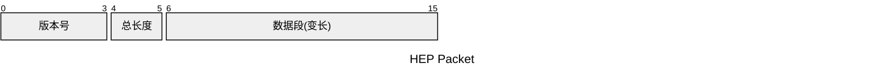
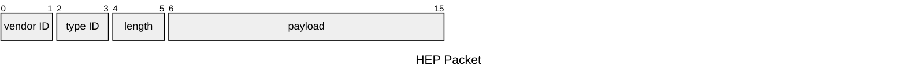
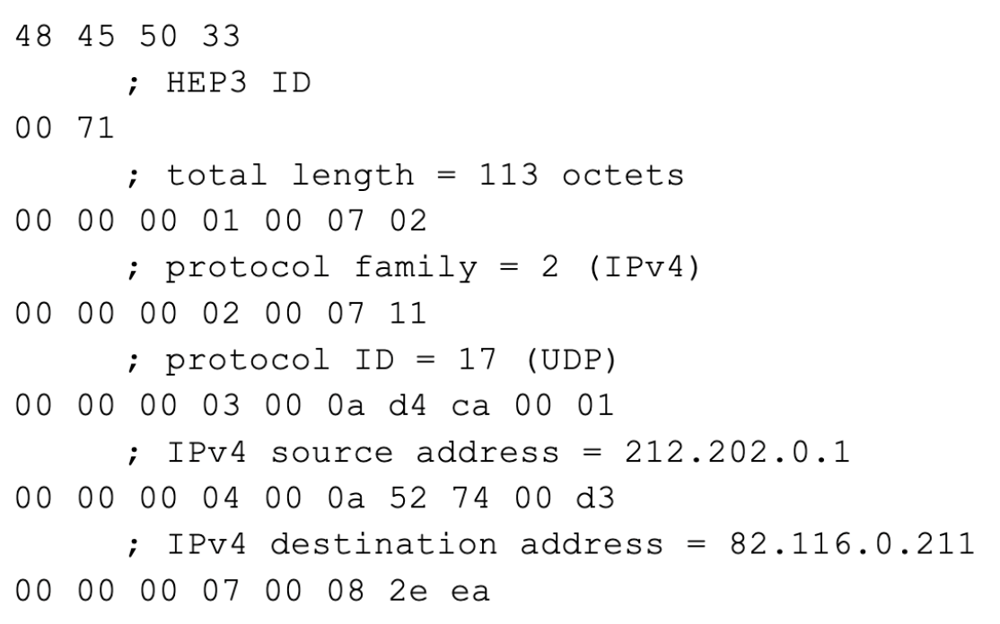

# HEP简介

HEP协议目前叫做EEP(Extensible Encapsulation Protocol), 那之前的缩写HEP的H，我只能推测为homer。

这个协议的主要功能是对VoIP连路上的数据包，例如SIP进行封装，方便后续分析SIP信令图。

目前这个协议已经升级到V3版本，在这个pdf[HEP3_Network_Protocol_Specification_REV_36](https://github.com/sipcapture/HEP/blob/master/docs/HEP3_Network_Protocol_Specification_REV_36.pdf)中有详细的介绍。

今天我们主要看这个协议的V3版本的协议是如何实现的。


# 包头



HEPv3的包头是6个字节，主要分为三个部分
- 版本号：固定4个字节长度，是HEP3
- 总长度：固定2个字节长度，是包的总长度，这个总长度包括了包头的六个字节。所以HEP包的大小范围一般是6-65535之间。
- 数据段：数据段的长度不固定

> 注意事项：假如从传输层读到1000个字节的数据，在解析前6个字节是，发现总长度(total length)的子段是1200，那就说明本次读到的数据还不是一个完整的

# 数据段解析

数据段由固定6字节长度的头部和变长的payload部分。


- vendor ID: 固定2字节长度, 其实意义不大，
- type ID: 固定2字节长度，这个子段很重要，决定了payload的类型。可以理解为是一个对象的key, 然后把payload理解为value
- length: 固定2字节长度，范围是0-65535，这个字段是也是整个数据段的长度，也就是包括了6个字节的段头
- payload: 长度是length的长度-6，表示数据长度

hep协议有个type ID的映射表

| chunk type ID | 类型 | 描述 |
| --- | --- | --- |
| 0x0001 | uint8 | IP类型，0x02=IPv4, 0x0a=IPv6 
| 0x0002 | uint8 | 协议类型 0x06=TCP, 0x11=UDP， 可以参考[IP协议号列表](https://zh.wikipedia.org/wiki/IP%E5%8D%8F%E8%AE%AE%E5%8F%B7%E5%88%97%E8%A1%A8)

其他的字段还有很多，可以参考[HEP3_Network_Protocol_Specification_REV_36](https://github.com/sipcapture/HEP/blob/master/docs/HEP3_Network_Protocol_Specification_REV_36.pdf)


# HEP3例子分析



```
48 45 50 33 00 71
H  E  P  3  len=113
00 00 00 01 00 07 02
不重要 IP类型 长度为7, 减去6字节的头，payload长度为1字节, 也就是0x02, 值为2，表示IP用的是IPv4
00 00 00 02 00 07 11
      procotol ID = 17 (UDP)
```

> 关于 00 00 00 01 00 07 02， 02为什么代表IPv4, 关于这个问题，刚开始我也不清楚，而且还有个人提出issue https://github.com/sipcapture/HEP/issues/6  
> 按照 Address Family Numbers， IPv4对应的号码其实是1，但是hep协议的作者为什么定义为1，我觉得这个可能和INNA并没有什么关系。
> IPv4是2，那么IPv6是多少，规范里也没有说明，只能从一些代码里看出IPv6的号码是0x0a, 也就是10.

```go
// HEP chuncks
const (
	Version   = 1  // Chunk 0x0001 IP protocol family (0x02=IPv4, 0x0a=IPv6)
```


# 参考文档
- https://github.com/sipcapture/homer/wiki
- https://github.com/sipcapture/HEP/issues/6
- https://github.com/sipcapture/HEP
- https://github.com/sipcapture/HEP/blob/master/docs/HEP3_Network_Protocol_Specification_REV_36.pdf
- https://github.com/sipcapture/heplify/blob/master/decoder/decoder.go
- https://zh.wikipedia.org/wiki/IP%E5%8D%8F%E8%AE%AE%E5%8F%B7%E5%88%97%E8%A1%A8