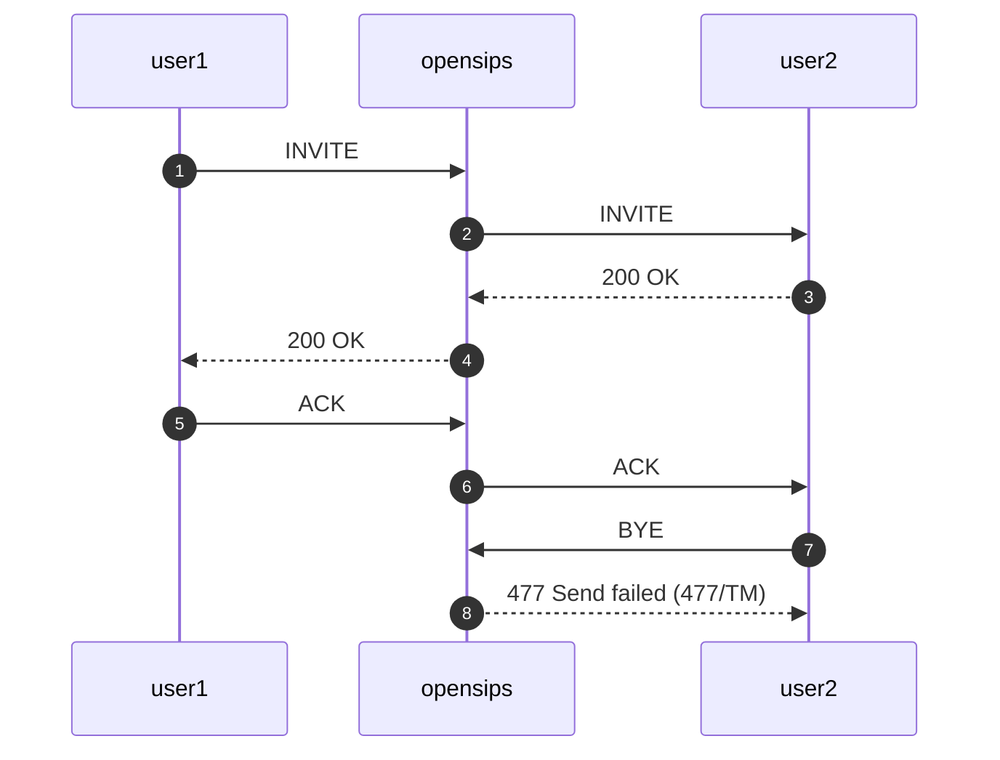
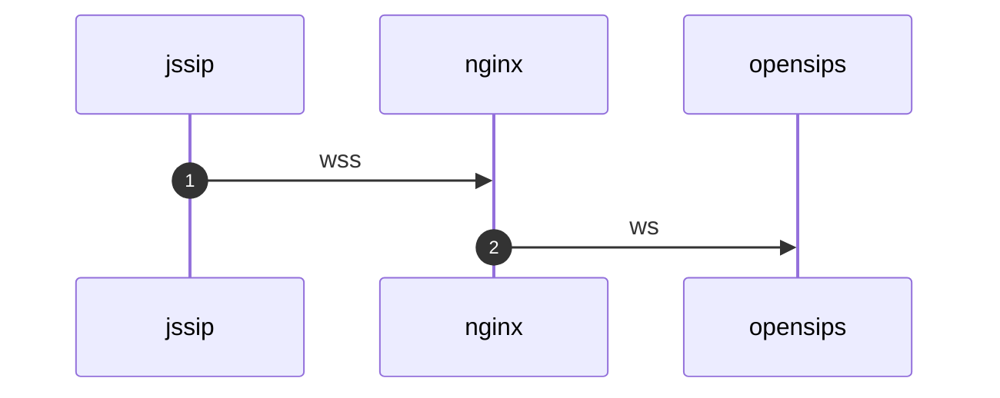

当听到分机无法挂断电话时，通常有以下几种可能的原因：

1. 在做Record-Route时，使用了错误的内外网IP地址。导致BYE请求按照route头发送时，无法正确找到对应的服务器。
2. Contact头部的URI不正确，导致BYE请求无法找到对应的服务器。

时序图如下；

477错误一般是按照route头或者contact转发时，找不到对应的socket。 在使用tcp作为传输协议时，例如tcp/tls/wss注册的分机比较常见。

有以下可能
1. 分机到opensips的tcp连接断开
2. contact使用错误的transport参数

从过观察第2个信令的Conact头，发现transport=ws, User-Agent=JSSip。 正常情况下，jssip应该使用wss作为transport。

所以解决办法是，在jssip的配置中，将transport改为wss。

还有一个解决方案， 就是让jssip通过nginx转发wss请求，让nginx转发到opensips的ws端口, 也能解决问题。

