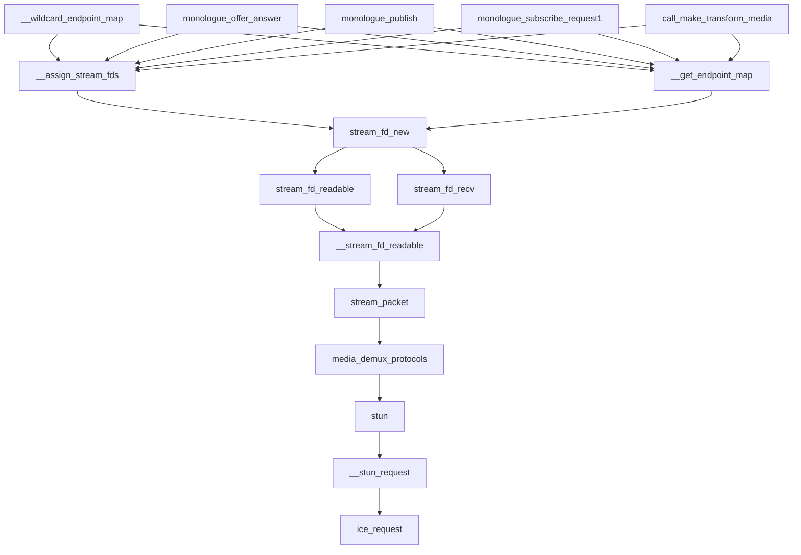
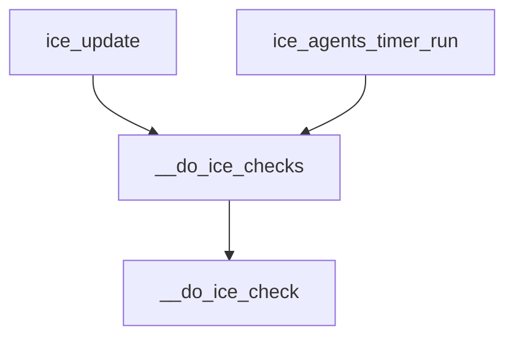

# STUN 请求处理



从SDP Offer之后，stream_fd_new 函数里做了几个事件订阅， 当对应的的媒体端口收到包之后，这个包可能是好几种协议，例如RTP, DTLS, STUN等。

在media_demux_protocols() 中决定了这个包是以上包的哪一种， 如果是STUN包，则进入stun()中处理。

STUN包也分为请求和响应，当消息是响应时，进入ice_request().

```c {linenos=inline hl_lines=["12-14"]}
int ice_request(stream_fd *sfd, const endpoint_t *src,
		struct stun_attrs *attrs)
{
	struct packet_stream *ps = sfd->stream;
	struct call_media *media = ps->media;
	struct ice_agent *ag;
	const char *err;
	struct ice_candidate *cand;
	struct ice_candidate_pair *pair;
	int ret;

	ilogs(ice, LOG_DEBUG, "Received ICE/STUN request from %s on %s",
			endpoint_print_buf(src),
			endpoint_print_buf(&sfd->socket.local));

```

