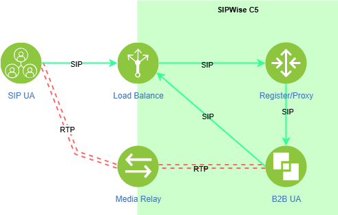

# SIPWISE C5 ARCH

Sipwise C5（又称NGCP——下一代通信平台）是一款基于SIP的开源Class 5 VoIP软交换平台

# 参考
- https://www.sipwise.com/doc/mr6.5.8/sppro/ar01s02.html
- https://www.sipwise.com/doc/mr10.3.1/spce/ce/mr10.3.1/architecture/architecture.html