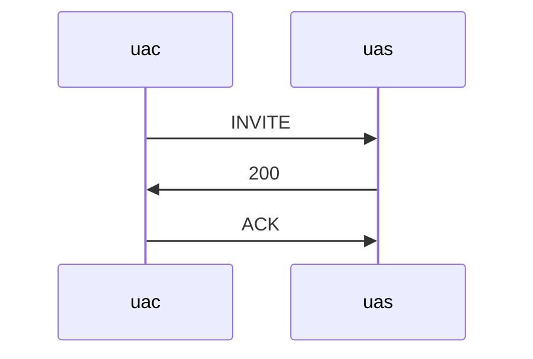

# 简介

这里我们把ACK的场景限定到INVITE收到200响应之后，UAC构造ACK消息的URI来自哪里？

这里的时序图为

我们要把这个问题讲清楚，不要臆造，并且必须提供RFC3261的原文作为参考。

# RFC3261解读

📌 13.2.2.4
> The UAC core MUST generate an ACK request for each 2xx received from the transaction layer

✏️ 这里说明，在UAC收到INVITE 200 OK后，必须回复ACK消息。

📌 12.2.1.1 Generating the Request
> The UAC uses the remote target and route set to build the Request-URI and Route header field of the request. If the route set is empty, the UAC MUST place the remote target URI into the Request-URI. The UAC MUST NOT add a Route header field to the request. If the route set is not empty, and the first URI in the route set contains the lr parameter (see Section 19.1.1), the UAC MUST place the remote target URI into the Request-URI and MUST include a Route header field containing the route set values in order, including all parameters.

✏️ 这里说明，在UAC构造ACK消息时，Request-URI主要是由 remote target 和 route set决定。

- 当route set为空时，Request-URI为remote target
- 当route set不为空时，并且route set的第一个URI包含lr参数，Request-URI为remote target

那这里就必须要解释一下，什么是**remote target**呢？

# 什么是remote target？

remote target在RFC3261中一共出现19次，但是在**6 Definitions**中，却没有对其做定义。 我们只能从这19处描述，来理解其定义。

📌 12 Dialogs
>  This state consists of the dialog ID, a local sequence number (used to order requests from the UA to its peer), a remote sequence number (used to order requests from its peer to the UA), a local URI, a remote URI, remote target, a boolean flag called "secure", and a route set, which is an ordered list of URIs.

✏️ 在第12章，关于dialog状态的定义中，remote target被定义dialog的一个状态属性。 但是也没有说明这个值来自哪里？

但是在12.1.1 和 12.1.2 中，又分别有对remote target的描述。即 **remote target = Contact URI**

📌 12.1.1 UAS behavior
> The remote target MUST be set to the URI from the Contact header field of the request.

📌 12.1.2 UAC Behavior
> The remote target MUST be set to the URI from the Contact header field of the response.

# 结论

ACK消息的URI来自INVITE的Contact URI。 并且必须设置为响应消息的Contact URI。