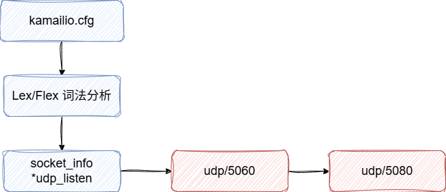
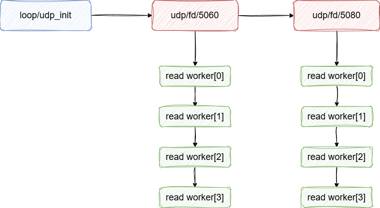
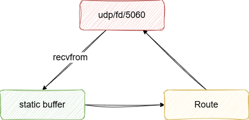
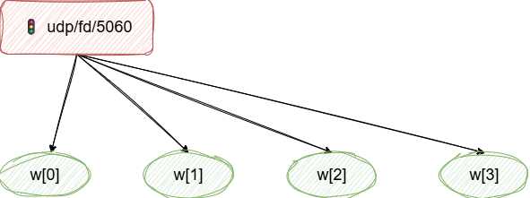
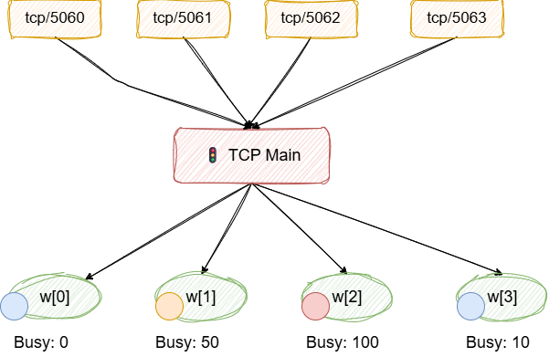
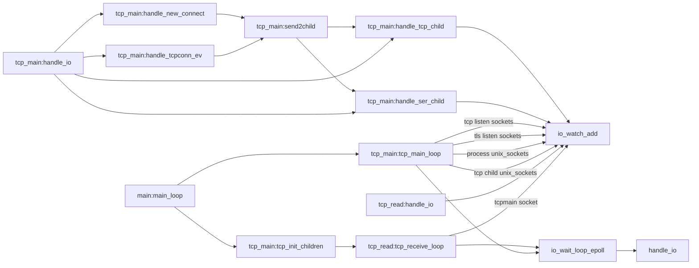
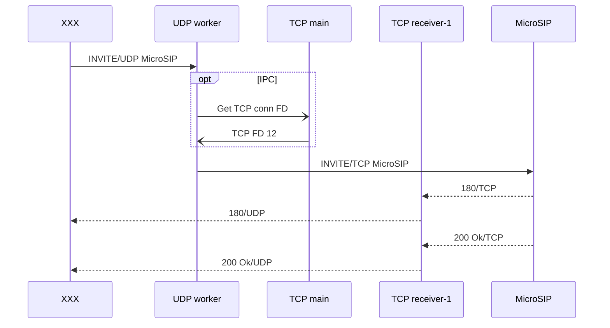

- [1. 概述](#1-概述)
- [2. UDP Socket进程处理分析](#2-udp-socket进程处理分析)
  - [2.1. UDP端口信息收集](#21-udp端口信息收集)
  - [2.2. 端口绑定](#22-端口绑定)
  - [2.3. 进程fork阶段](#23-进程fork阶段)
  - [2.4. UDP read 阶段](#24-udp-read-阶段)
  - [2.5. UDP 消息进程间负载均衡阶段](#25-udp-消息进程间负载均衡阶段)
- [3. TCP消息处理分析](#3-tcp消息处理分析)
  - [3.1. 消息处理模型](#31-消息处理模型)
  - [3.2. 负载均衡策略](#32-负载均衡策略)
  - [3.3. 调用链分析](#33-调用链分析)
- [4. 举例说明： UDP读TCP发](#4-举例说明-udp读tcp发)


# 1. 概述

kamailio SIP消息处理进程主要分为三类。

| 类别 | 功能 | 数量 |
| --- | --- | --- |
| UDP worker进程 | 处理以UDP传输的SIP消息 | port * children |
| TCP main进程 | 负责tcp链接管理，生命周期维护，tcp work的消息分发 | 1 |
| TCP worker进程 | 处理以TCP传输的SIP消息 | children |

以下面的配置为例：

则SIP消息处理进程数量为：`4 * 2 + 1 + 4` = 13个

```sh
children=4
listen=udp:127.0.0.1:5060
listen=udp:127.0.0.1:5080
listen=tcp:127.0.0.1:5061
```

在生成环境，建议children设置为`CPU核数`,  这样能最大化利用多核能力，并且避免太多的进程切换。

# 2. UDP Socket进程处理分析

UDP Socket处理主要分为三个步骤

1. UDP端口信息收集
2. 端口绑定
3. 进程fork

## 2.1. UDP端口信息收集



---

## 2.2. 端口绑定


---

## 2.3. 进程fork阶段



---

## 2.4. UDP read 阶段

udp recvfrom() 都是读到一个静态的buffer区域中，这个静态buffer会一直循环利用，而不是每次都申请。



---

## 2.5. UDP 消息进程间负载均衡阶段



1. **套接字共享**：所有进程共享一个套接字文件描述符
2. **竞争接收**：一组相同端口的worker都从相同的套接字上等待接收消息，但是只有一个能收到消息
3. **内核级调度**： 当UDP数据包到达时
   1. 将数据包放到套接字接收缓冲区
   2. 唤醒一个正在等待的进程
   3. 被唤醒的集成调用recvfrom()获取数据

内核的调度策略，无法预测，可能INVITE在woker1上，ACK在woker2上，BYE在woker3上，CANCEL在woker4上。
在大量消息的情况下，只能做到大致均衡。

这种调度优缺点都非常明显

- **优点**
  - 高并发，充分利用多核CPU
  - 高效率，无需应用层调度
  - 低延迟，消息直接由进程处理
- **缺点**
  - 惊群效应，多个进程被唤醒，只有一个能读到消息
  - 负载不均衡，某些进程可能更活跃
  - 消息顺序，无法保证消息顺序。例如可能先处理了CANCEL, 再处理了INVITE
  - 编程复杂，始终考虑多进程的边界，稍不注意，日志打印都会引起coredump

---


# 3. TCP消息处理分析

## 3.1. 消息处理模型
TCP消息的处理阶段和UDP处理的类似，唯一的区别是， TCP woker进程的数量和端口无关，而只和children参数有关。

这里主要讲一下tcp_poll_method

kamailio在三种pool模型上层做了封装.


| 维度 | select | epoll | kqueue |
| --- | --- | --- | --- |
|平台 | 通用 | Linux | BSD |
| 可监控数 | ~1014 | 10W+ | 10W+ |
| 复杂度 | O(n) | O(1) | O(1) |
| 内存拷贝 | 每次 | 仅注册 | 仅注册 |
| 适合 | 小规模 | 高并发 | 高并发 | 


## 3.2. 负载均衡策略



- **应用级分配**
  - TCP链接由TCP Main进程负责分配
  - accept新的TCP/TLS链接
  - 维护TCP链接的生命周期
- **负载策略**
  - 选择最小负载的tcp worker进程
- **链接亲和性**
  - 当conn[1]第一次被绑定到tcp woker[1]上时， 后续从conn[1]上读数据都会由worker[1]处理。 注意，链接在未收到任何数据时，不会分配给任何的worker。


## 3.3. 调用链分析



整个调用链关系很复杂，但是重点只需要关注几类事件

- **TCP Main**
  - 事件回调handle_io
    - **F_SOCKINFO** 新的TCP链接建立
    - **F_TCPCONN** 链接断开，可读，可写等等
    - **F_TCPCHILD** 来自TCP子进程的消息
    - **F_PROC** 来自其他进程的消息
  - 事件订阅tcp_main_loop
    - POLLN
      - tcp SIP 链接
      - tls SIP 链接
      - unix_sock 通用进程间通信
      - tcp_children TCP子进程通信

# 4. 举例说明： UDP读TCP发

场景说明
- SIP INVITE从UDP端口接收, 然后发现目标地址是一个TCP地址，而且这个链接已经存在

