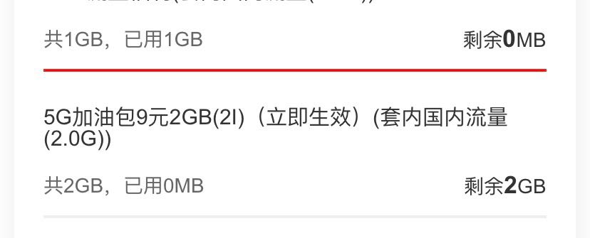
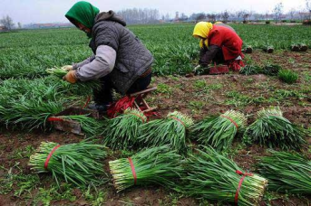

联通官方客服已经开始割韭菜了。

前两天10010给我打电话，一个女客服操着浓重的口音，兴奋的给说我是优质客户，然后因为回馈老用户的关系，每个月会多送我2个G的5G高速流量。

我当时很警觉，立马问她这个会对我原来的套餐有影响吗，她说没任何影响，接着殷切的问我要不要办理。我思考了一下，觉得不用花钱，又多了2个G的流量，索性就办理了。

今天我在联通掌上营业厅上查自己的实时话费，突然多出了一项9元的流量叠加包月套餐费。的确对我原来的套餐没有影响，只是多了一个新的业务。😂

我思来想去，我应该没有办理这个套餐啊？哪里冒出来的。然后仔细的从迷宫似的掌上营业厅上查找套餐信息。结果给我找到了下面的信息。

**我当时很生气**，当时客服给我介绍流量包的时候，从始至终没有提这个流量包要收费的事情。**我也是大意了，没有闪。**

接着我就打了10010的官方客服，然后走人工投诉，最终取消了这个套餐。

我想，这种电话应该很多人都接过吧，被骗的应该不只是少数，如果不仔细看自己的账单，我也不知道有这件事情。

从这件事事情我也反省自己：

1. 官方客服也不要信
2. 客服说的话，都要当作放屁
3. 没有看到黑纸白字的承诺，都是骗人的
4. 不要想贪小便宜，否则自己就会被当作韭菜

