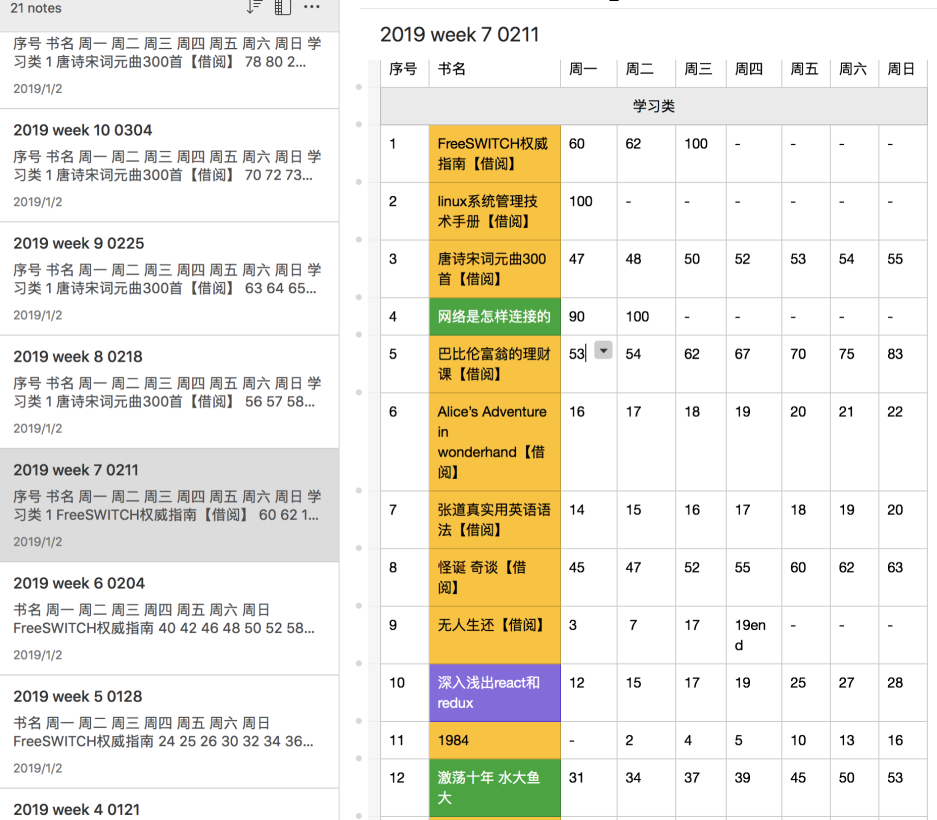

2018年1月26日，我在京东上买了一个Kindle Paperwhite, 距离今天，大概已经2年多一点了。

我是一个重度读者，每天都会花上一些时间去阅读。最近两天发现，本来可以连续两周不用充电的kindle。基本上现在是电量以每天50%的速度减少。或许，2年，就是kindle的寿命。

刚开始读书总觉得没有什么进度，后来我就喜欢把每天读书的进度给记录下来。这样做的好处是能够督促我不要偷懒，

我读书有个习惯，每天以至少1%的进度去读一本书，并且我会将进度记录下来。基本上，我每天会读7-8本书的1%。

两年时间内我读过的书，要比我从小学到大学读过的书都要多。

