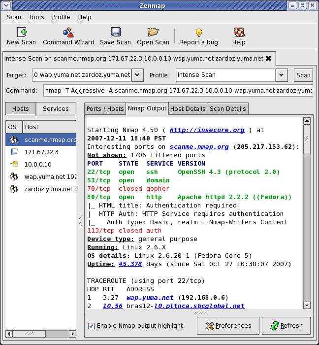

有时候，客户端的udp包被中间的防火墙拦截了，在linux上可以很简单的用nc启动一个udp server

```javascript
# 启动udp server 监听8888端口
nc -ulp 20000

# 启动udp client
nc -u 127.0.0.1 20000
```

在linux上启动nc udp server很简单，但是在windows上，没办法安装nc啊？😭


# 峰回路转

- [https://nmap.org/download.html](https://nmap.org/download.html)

在查看了nc的官网之后，发现nc实际上也提供了windows的程序，有两种版本。

- 有GUI界面的，使用友好，安装包比较大 [https://nmap.org/dist/nmap-7.91-setup.exe](https://nmap.org/dist/nmap-7.91-setup.exe)
- 仅仅在命令行下执行，刚好满足需求  [https://nmap.org/dist/nmap-7.91-win32.zip](https://nmap.org/dist/nmap-7.91-win32.zip)


看看带GUI界面的<br />




# 附件

- [nmap-7.91-win32.zip](https://www.yuque.com/attachments/yuque/0/2021/zip/280451/1623822081147-3d08abd7-dd5b-44c5-a614-5efae58c131f.zip?_lake_card=%7B%22src%22%3A%22https%3A%2F%2Fwww.yuque.com%2Fattachments%2Fyuque%2F0%2F2021%2Fzip%2F280451%2F1623822081147-3d08abd7-dd5b-44c5-a614-5efae58c131f.zip%22%2C%22name%22%3A%22nmap-7.91-win32.zip%22%2C%22size%22%3A15303896%2C%22type%22%3A%22application%2Fzip%22%2C%22ext%22%3A%22zip%22%2C%22status%22%3A%22done%22%2C%22taskId%22%3A%22u9c45e4b6-d2b6-458f-8fc3-a8fc5dd3563%22%2C%22taskType%22%3A%22upload%22%2C%22id%22%3A%22uef5519c9%22%2C%22card%22%3A%22file%22%7D)

