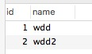
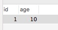
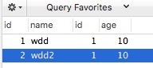

表wdd_a<br />


表wdd_b<br />



不使用where子句生成的表的数是两个表行数的积，其字段的字段两个表的拼接

查询的行数 = 表a的行数 x 表b的行数

```sql
SELECT * FROM `wdd_a` join `wdd_b` order by wdd_a.id
```



表联合不使用where子句，会存在两个问题

1. 查询出来的结果没有意义
2. 产生大量的无用数据，例如1000行的表a联合1000行的表b，将会产生1000*1000行的结果

```sql
SELECT * FROM `wdd_a` join `wdd_b` where wdd_a.id = wdd_b.id
```
当使用表联合之后，产生的数据

1. 是有意义的
2. 查询结果的行数一定比两张表的行数都要少

**下面是一个复杂的例子，给表起了别名，另外也只抽取了部分字段**

```sql
SELECT
   `a`.`id` AS `id`,
   `a`.`caller_id_dpid` AS `caller_id_dpid`,
   `a`.`callee_id_dpid` AS `callee_id_dpid`,
   `a`.`trunk_group` AS `trunk_group`,
   `b`.`domain` AS `domain`
FROM (`wj_route_group` `a` join `domain` `b`) where (`a`.`id` = `b`.`route_group_id`);
```


