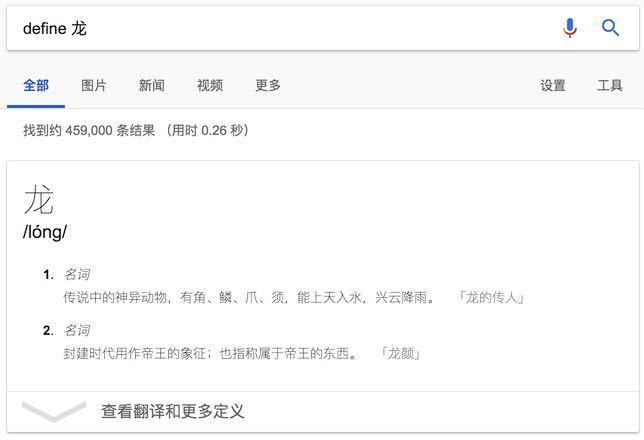
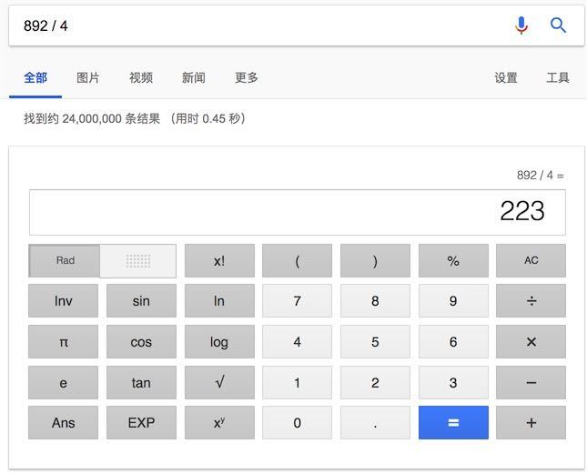
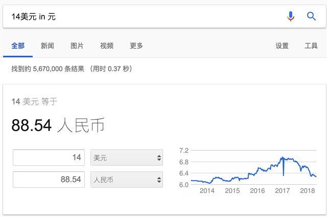
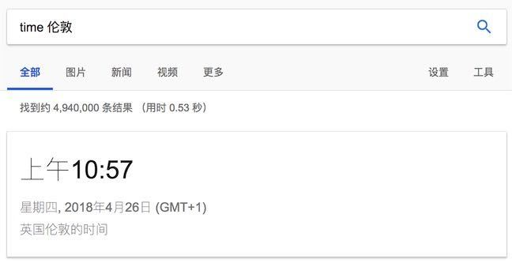
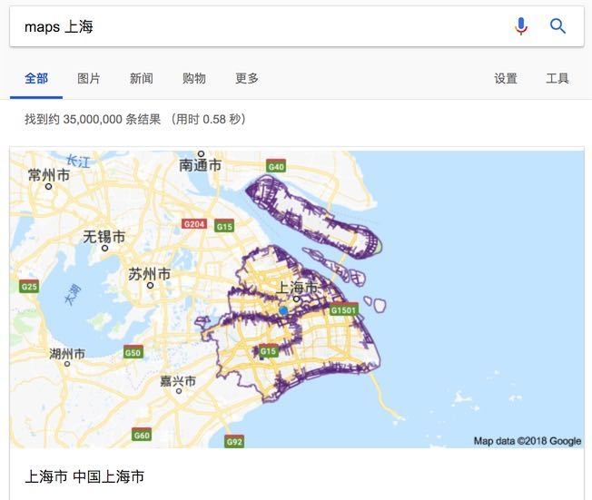
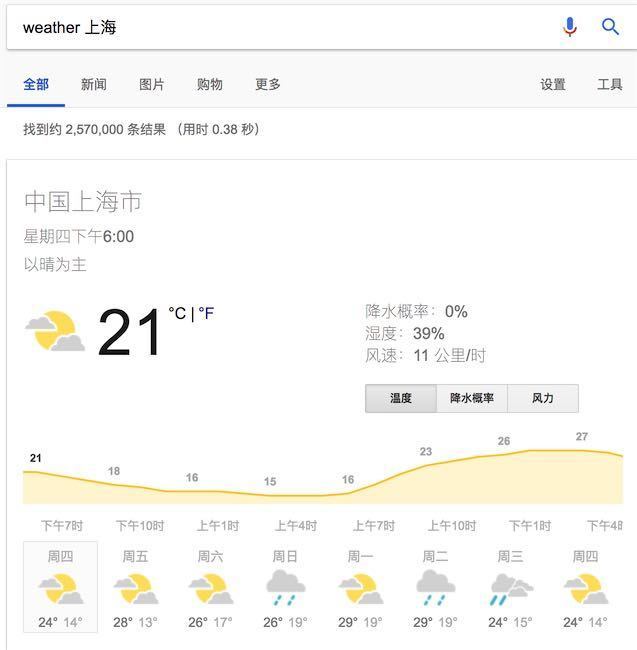

# 1. 谷歌搜索指令

# 2. 基本命令
| 符号 | 简介 | 语法 | 注意点 | 示例 |
| --- | --- | --- | --- | --- |
| + | 包含A且必须包含B | A +B | A和+之间有空格 | Maxwell +wills |
| - | 包含A且不包含B | A -B | A和+之间有空格 | Maxwell -Absolom |
| " " | 完整匹配AB | "AB" |  | "Thomas Jefferson" |
| OR | 包含A或者B | `A OR B` 或者 `A | B` |  | nodejs OR webpack |
| +-"OR | 指令可以组合，完成更复杂的查询 |  |  | beach -sandy +albert +nathaniel |
| ~ | 包含A, 并且包含B的近义词 | A ~B |  | github ~js |
| .. | 区间查询 AB之间 | A..B |  | china 1888..2000 |
| * | 匹配任意字符 |  |  | node* java |
| site: | 站内搜索 | A site:B |  |  |
| filetype: | 按照文件类型搜索 | A filetype:B |  | csta filetype:pdf |

# 3. 关键词使用
| 方法 | 说明 | 示例 |
| --- | --- | --- |
| 列举关键词 | 列举所有和搜索相关的关键词，并且尽量把重要的关键词排在前面。`不同的关键词顺序会导致不同的返回不同的结果` | 书法 毛笔 绘画 |
| 不要使用某些词 | 如代词介词语气词，如i, the, of, it, 我，吗 | 搜索引擎一般会直接忽略这些信息含量少的词 |
| 大小写不敏感 | 大写字符和小写字符在搜索引擎看没有区别，尽量使用小写的就可以 |  |

# 4. 特殊工具

## 4.1. define 快速返回关键词定义

## 4.2. 计算器

## 4.3. 单位转换

## 4.4. 时区查询

## 4.5. 地区查询

## 4.6. 天气查询

# 5. 参考

- [Advanced Google Search Commands](https://www.lifewire.com/advanced-google-search-3482174)
- [Google_rules_for_searching.pdf](https://uvtagg.org/classes/smaxwell/Google_rules_for_searching.pdf)
- [An introduction to search commands](http://www.searchcommands.com/)

