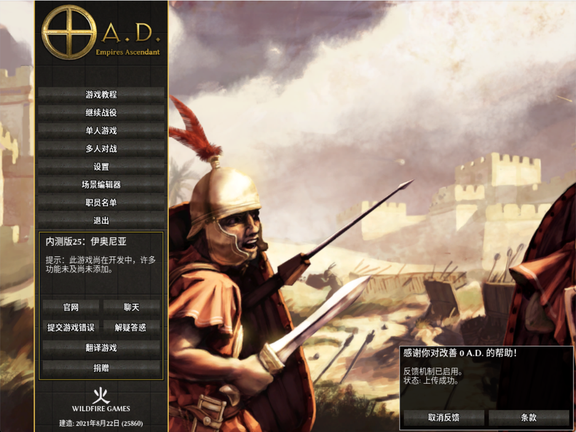
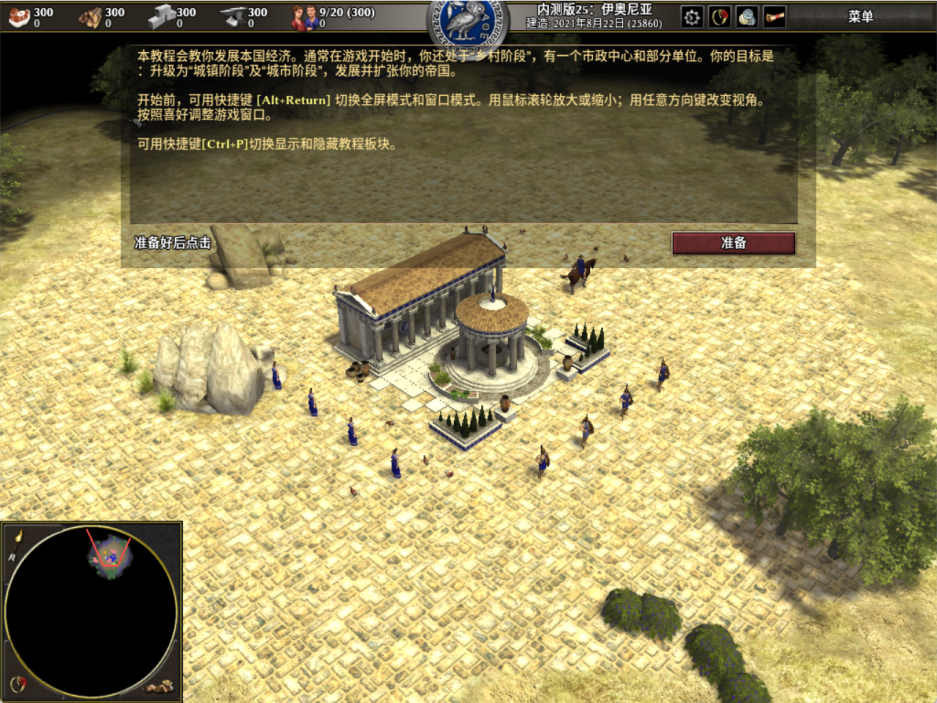
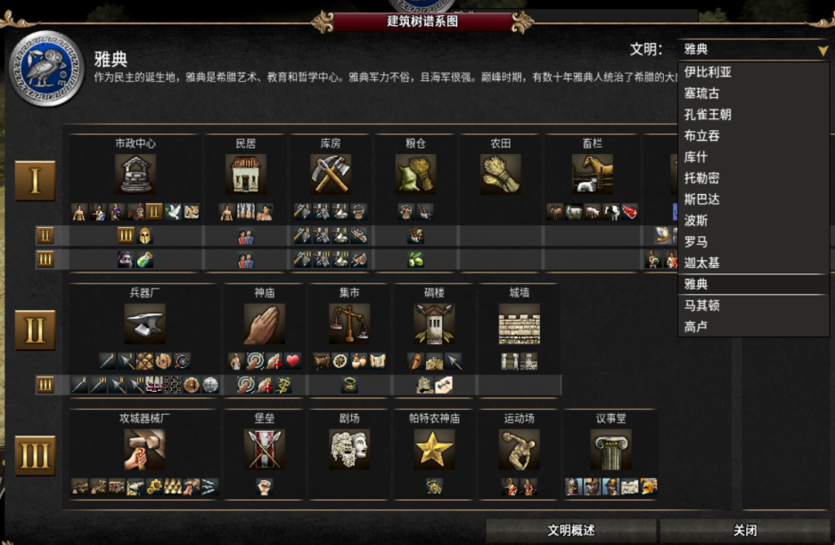

# 1. 我为什么会知道0 A.D. 这款游戏？
最近切换到windows开发，用了[scoop](https://scoop.sh/#/)这个包管理工具来安装软件，随便逛逛的时候，发现scoop还可以用来安装游戏，然后我就在里面看了一下，然后排名第一的是一个名叫 0 A.D.的游戏，然后我就安装，并试玩了一下。

# 2. 0 A.D. 这个名字是啥意思？
基督教称耶稣诞生的那年为公元元年， A.D. 就是Anno Domini（A.D.）（拉丁）的缩写，对应的公元前就是而在耶稣诞生之前，称为B.C. Before Christ（B.C.）.

我们现在的阳历，例如今年是2022年，这其实就是公元2022年。对应的公元元年，对中国来说，大致在西汉年间。

所以 0 A.D. 其实的意思就是一个不存在的元年。 

> **“0 A.D.” is a time period that never actually existed:**

# 3. 0 A.D. 是什么类型的游戏？

如果你玩过红警，0 A.D.的有点像红警。 官方的介绍0AD是一个基于历史的实时策略游戏。  如果你玩过部落冲突，0AD其实也有点类似部落冲突。

# 4. 0 A.D.  有什么特点？

- 跨平台， windows, mac, linux都可以玩
- 免费
- 历史悠久，项目开始于2001
- 还处于开发阶段
- 可玩性还不错
- 基于真实历史，所以玩游戏的时候，也是能够学点历史的。里面有是14个文明。

# 5. 有哪些玩法

- 单机和AI对战
- 在线组队玩

# 6. FAQ

- 如何设置中文界面
   - 默认的游戏不带中文语言的，实际上它是有中文的语言包的，可以参考 

# 参考

- [https://baike.baidu.com/item/%E5%85%AC%E5%85%83/17855](https://baike.baidu.com/item/%E5%85%AC%E5%85%83/17855)

