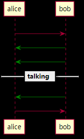
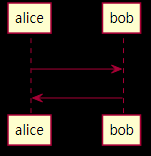
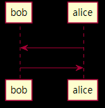
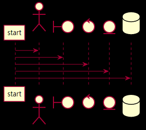
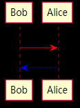
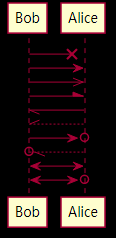
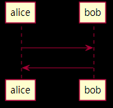

我觉得PlantUML非常适合绘制时序图，先给个完整的例子，我经常会用到的PlantUML画SIP请求时序图。

```bash
@startuml
autonumber
alice->bob: INVITE
bob-[#green]>alice: 180 Ringing
bob-[#green]>alice: 200 OK
== talking ==
bob-[#green]>alice: BYE
alice->bob: 200 OK
@enduml
```
<br />




# 简单箭头

- --> 虚线箭头
- -> 简单箭头
- -[#red]> 带颜色的箭头

```bash
@startuml
alice->bob: INVITE
bob-->alice: 180 Ringing
@enduml
```


# 声明参与者顺序
先使用participant关键字声明了bob， 那么bob就会出现在最左边

```bash
@startuml
participant bob
participant alice
alice->bob: INVITE
bob->alice: 180 Ringing
@enduml
```



# 声明参与者类型

- `actor`
- `boundary`
- `control`
- `entity`
- `database`

```bash
@startuml

participant start
actor a
boundary b
control c
entity d
database e

start->a
start->b
start->c
start->d
start->e
@enduml
```



# 箭头颜色

- -[#red]>
- -[#0000ff]->
```bash
@startuml
Bob -[#red]> Alice : hello
Alice -[#0000FF]->Bob : ok
@enduml
```



# 箭头样式

```bash
@startuml
Bob ->x Alice
Bob -> Alice
Bob ->> Alice
Bob -\ Alice
Bob \\- Alice
Bob //-- Alice

Bob ->o Alice
Bob o\\-- Alice

Bob <-> Alice
Bob <->o Alice
@enduml
```


# 箭头自动编号

设置autonumber<br />
```bash
@startuml
autonumber
alice->bob: INVITE
bob-->alice: 180 Ringing
@enduml
```

<br />
