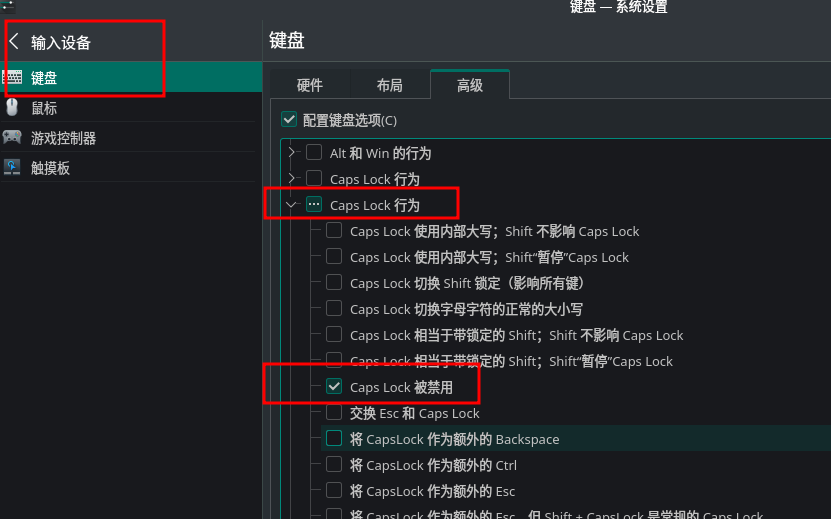

# 1. 安装vivaldi浏览器
```
pamac install vivaldi
```
参考：[https://wiki.manjaro.org/index.php/Vivaldi_Browser](https://wiki.manjaro.org/index.php/Vivaldi_Browser)


# 2. 关闭三次密码错误锁定
修改/etc/security/faillock.conf， 将其中的deny取消注释，并改为0，然后注销。重新登录。
```
deny = 0
```


# 3. 禁用大写锁定键
在输入设备中，选择键盘-》高级》 Caps Lock行为， 选中Caps Lock被禁用， 然后应用。<br />

