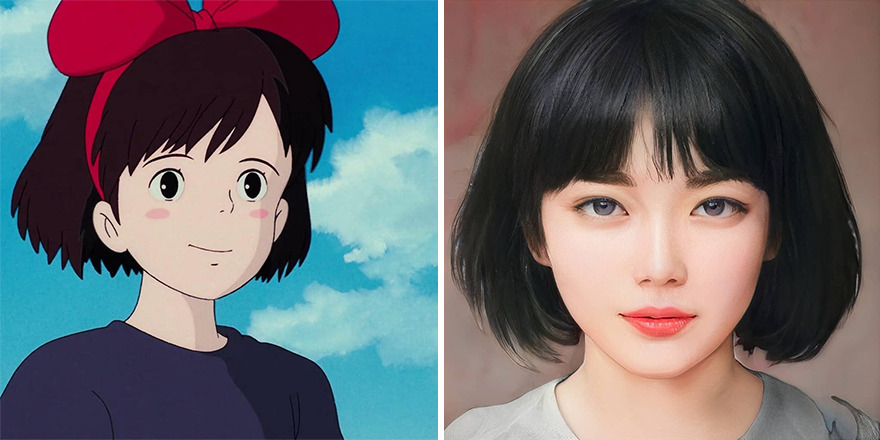
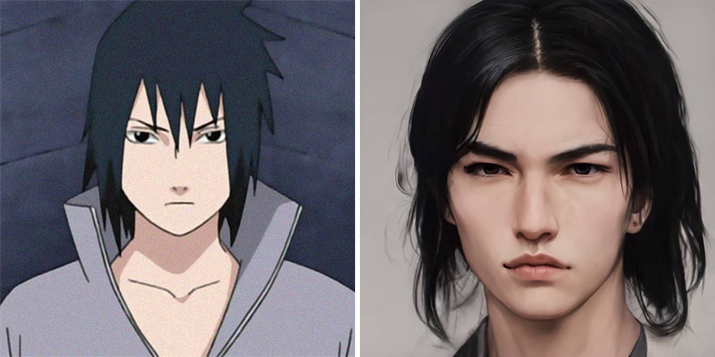
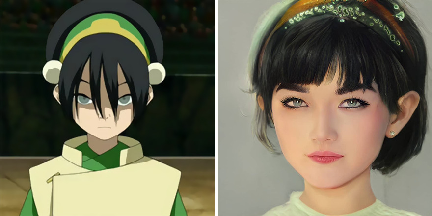
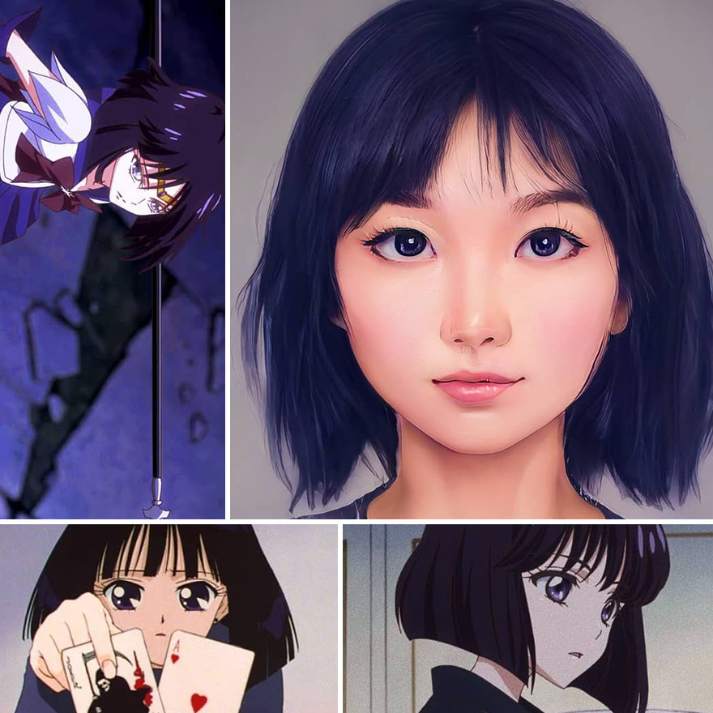
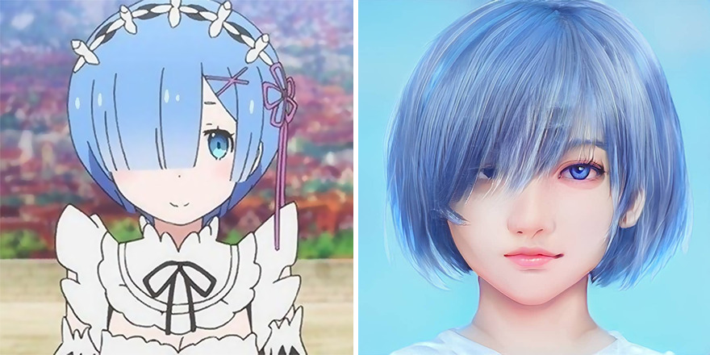

# 魔女宅急便 琪琪

# 有点像花木兰

# 佐助

# 不认识

# 小樱

# 不认识

# 不认识

# 不认识

# 参考

- [https://designyoutrust.com/2021/04/person-uses-artificial-intelligence-to-make-anime-and-cartoon-characters-look-more-realistic/](https://designyoutrust.com/2021/04/person-uses-artificial-intelligence-to-make-anime-and-cartoon-characters-look-more-realistic/)

