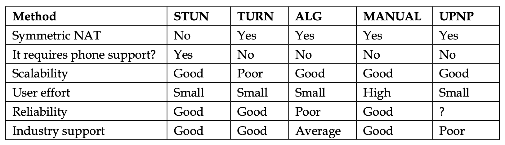

# 4种NAT类型
| NAT类型 | 接收数据前是否要先发送数据 | 有没有可能检测下一个IP:PORT对是否打开 | 是否限制发包目的的IP:PORT |
| --- | --- | --- | --- |
| 全锥型 | no | yes | no |
| 限制锥型 | yes | yes | only IP |
| 端口限制型 | yes | yes | yes |
| 对称型 | yes | no | yes |

# NAT穿透

• STUN: Simple traversal of UDP over NAT • TURN: Traversal of UDP over Relay NAT • ALG: Application Layer Gateways • MANUAL: Manual configuration (port forwarding) • UPNP: Universal Plug and Play

