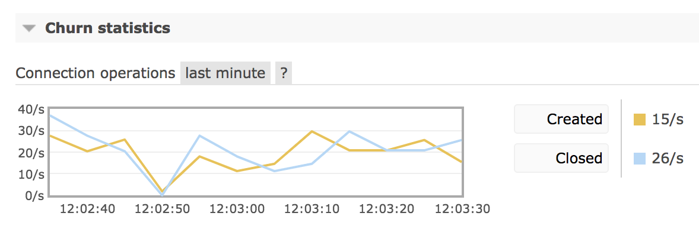
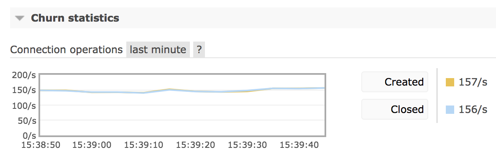
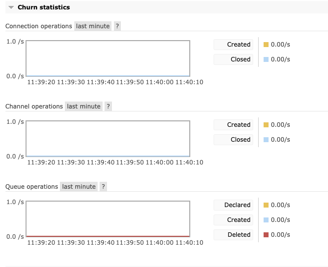

# 连接抖动介绍
> Workloads with high connection churn (a high rate of connections being opened and closed) will require TCP setting tuning to avoid exhaustion of certain resources: max number of file handles, Erlang processes on RabbitMQ nodes, kernel's ephemeral port range (for hosts that open a lot of connections, including Federation links and Shovel connections), and others. **Nodes that are exhausted of those resources won't be able to accept new connections**, which will negatively affect overall system availability.

连接抖动，就是在单位时间内，有大量的连接产生，也同时有大量的连接关闭。这些抖动将会耗费大量的资源。

从RabbitMq 3.7.9开始，引入了对抖动数据的统计。在mq管理界面上，可以看到下面的图标。

下面是随时间变化，mq连接数的抖动情况。 

> While connection and disconnection rates are system-specific, rates consistently above 100/second likely indicate a suboptimal connection management approach by one or more applications and usually are worth investigating.

**如果抖动的指标持续的超过每秒100个，这就需要引起注意了，需要调查下具体的抖动原因。**

# 抖动统计
抖动统计包括三个方面

- Connection
- Channel
- Queue

# 参考

- [https://www.rabbitmq.com/connections.html#high-connection-churn](https://www.rabbitmq.com/connections.html#high-connection-churn)
- [https://www.rabbitmq.com/networking.html#dealing-with-high-connection-churn](https://www.rabbitmq.com/networking.html#dealing-with-high-connection-churn)
- [https://vincent.bernat.ch/en/blog/2014-tcp-time-wait-state-linux](https://vincent.bernat.ch/en/blog/2014-tcp-time-wait-state-linux)
- [https://www.rabbitmq.com/troubleshooting-networking.html#detecting-high-connection-churn](https://www.rabbitmq.com/troubleshooting-networking.html#detecting-high-connection-churn)

