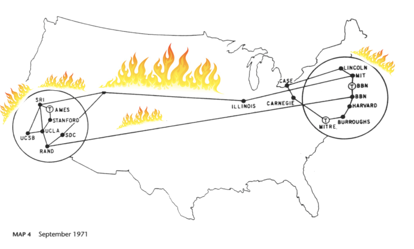
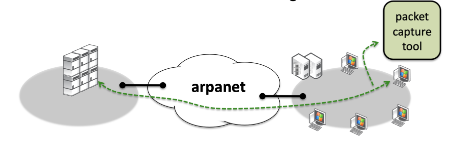

故事发生在1988年的美国。这一年互联网的始祖网络，阿帕网已经诞生了将近20年。而我们所熟知的linux将在三年后，也就是1991才出现。

在1988年，这时候的互联网只有阿帕网。 然而这个网络并没有想象中的那么好用，他还存在很多问题，而且也经常崩溃。

解决阿帕网崩溃的这个问题，落到了LBL（Lawrence Berkeley National Laboratory 实验室的肩上。

这个实验室有四个牛人，他们同时也是tcpdump的发明人。

- Van Jacobson
-  Sally Floyd
- Vern Paxson
-  Steve McCanne

这个实验室主要的研究方向是TCP拥塞控制、BSD包过滤、VoIP等方向。

为了解决阿帕网经常崩溃的问题，就必须要有一个好用的抓包工具。

 本着不重复造轮子的原则，这时候也已经又了一个叫做etherfind的工具，但是这个工具有以下的问题

- 包过滤的语法非常蹩脚
- 协议编解码能力非常弱
- 性能也非常弱

总之一句话，他们认为etherfind不行。

工欲善其事，必先利其器。所以他们就想创造一个新的工具。这个工具必须要有以下的特征

- 能够从协议栈底层过滤包
- 把高级的过滤语法能够编译的底层的代码
- 能够在驱动层进行过滤
- 创建了一个内核模块叫做 Berkeley Packet Filter(BPF)

# 参考

- [https://baike.baidu.com/item/ARPAnet/3562284](https://baike.baidu.com/item/ARPAnet/3562284)

