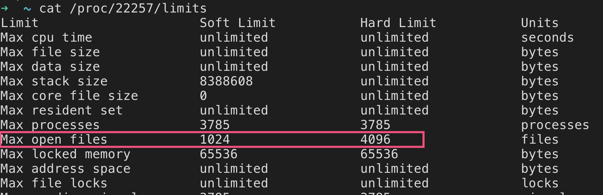
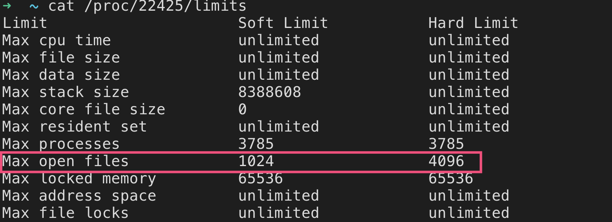

最近遇到一个问题，WebSocket总是会在下午出现比较大的断开的量。

首先怀疑的是客户端的网络到服务端的网络出现抖动或者断开，要么就是入口的nginx有异常，或者是内部的服务出现异常。

排查下来，发现nginx的最大打开文件个数是1024

nginx master进程<br />



nginx work进程<br />



# 当进程打开文件数超过限制时，会发生什么？

当进程超过最大打开文件限制时，会收到SIGXFSZ信号。这个信号会默认行为会杀死一个进程。进程内部也可以捕获这个信号。

我试着向nginx wrok进程发送SIGXFSZ信号, work进程会退出，然后master监听了这个事件后，会重新启动一个work进程。

```
kill -XFSZ work_pid
```

在nginx的error.log文件中，可以看到类似的日志输出。

这里的25就是XFSZ信号的整数表示。
```
... [alert] ...#.: work process ... exited on signal 25 
```
_<br />_<br />_


# 参考

- [https://www.monitis.com/blog/6-best-practices-for-optimizing-your-nginx-performance/](https://www.monitis.com/blog/6-best-practices-for-optimizing-your-nginx-performance/)
- [https://www.cnblogs.com/shansongxian/p/9989631.html](https://www.cnblogs.com/shansongxian/p/9989631.html)
- [https://www.cnblogs.com/jpfss/p/9755706.html](https://www.cnblogs.com/jpfss/p/9755706.html)
- [https://man7.org/linux/man-pages/man2/getrlimit.2.html](https://man7.org/linux/man-pages/man2/getrlimit.2.html)
- [https://man7.org/linux/man-pages/man5/proc.5.html](https://man7.org/linux/man-pages/man5/proc.5.html)

