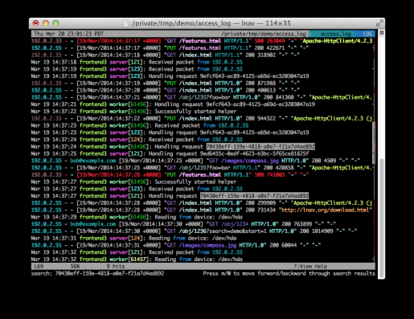
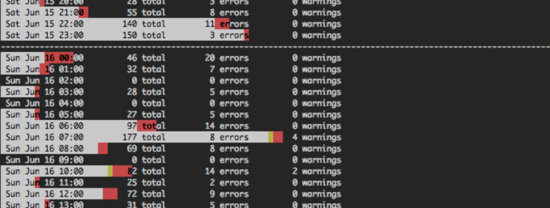
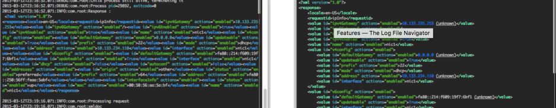
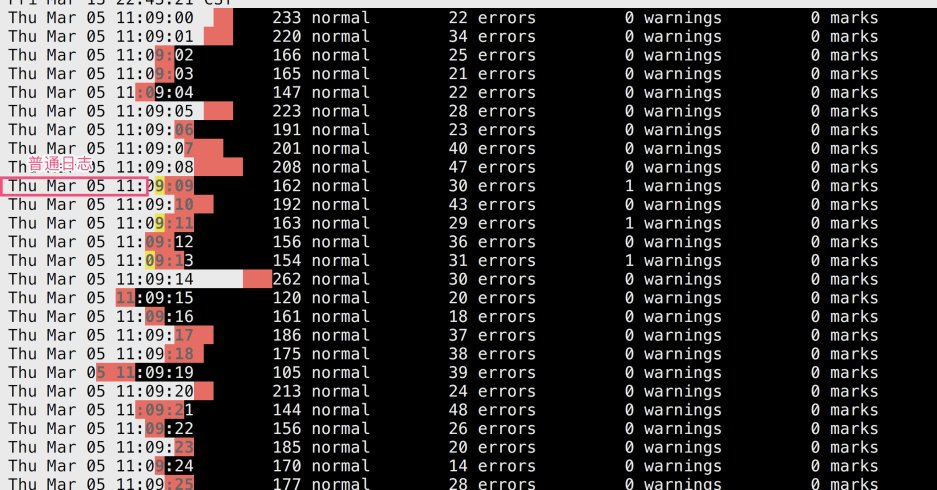

lnav, 不需要服务端，不需要设置，仍然功能强大到没有朋友。

# 速度与性能

lnav是一个可以运行在终端上的日志分析工具。功能非常强大，如果grep和tail等命令无法满足你的需求，或许你可以尝试一下lnav。

lnav的官方仓库是[https://github.com/tstack/lnav](https://github.com/tstack/lnav)，在mac上可以使用 `brew install lnav` 命令安装这个命令。

在我的4C8G的Macbook Pro上，打开一个2.8G的日志文件到渲染出现，需要花费约40s，平均每秒载入超过70MB。载入日志和渲染时，使用了接近100%的CPU。渲染完毕，使用1.2G的内存空间。

总之呢，这个工具载入日志的速度很快。但是最好不要再生产环境上使用这个命令载入过大的日志文件，否则可能造成系统资源消耗太大的问题。

在载入2.8G的日志文件后(3200多万行)，过滤时显得非常卡顿，但是查看日志并不卡顿。

在lnav的搜索关键字，下次打开其他日志时，lnav会自动搜索这个关键词。这是它的Session记录功能，可以使用Ctrl+R重置Session。

lnav的特点

- 语法高亮
- 各种过滤条件
   - 多关键词过滤
- 各种快捷跳转
- 自带统计和可视化功能，比如使用条形图展示单位时间内的报错和日志数量
- 自动日志格式检查。支持很多种日志格式
- 能够按照时间去过滤日志
- TAB自动补全
- 实时操作
- 支持SQL语法查日志
- 支持文件导出成其他格式
- 支持直接打开tar.gz等压缩后的日志文件
- 支持很多快捷键

x下面是按天的日志统计，灰色是普通日志，黄色是告警日志，红色的错误日志。三种颜色叠加的长度就是总日志。时间跨度单位也是可以调节的。最大跨度是一天，最短跨度是1秒。

# 仍然是日志格式

# 自动日志格式检测

- 系统日志
- Web服务器访问日志
- 报错日志
- 等等

# 过滤

- 可以设置多个过滤规则

# 时间线过滤

- 精确时间的日志
- 上个小时，下个小时
- 上一分钟，下一分钟

能够按照时间去追踪日志

# 按照时间周期统计

- 统计每秒出现的错误，告警和总日志的量

# 语法高亮

# Tab键自动补全

# 参考

- [https://lnav.readthedocs.io/en/latest/](https://lnav.readthedocs.io/en/latest/)
- 如果你更喜欢GUI工具，那也可以试试[https://github.com/nickbnf/glogg](https://github.com/nickbnf/glogg)

# 后记
最近因为工作需要，每天都会去排查很多的日志文件。我也曾想过装ELK之类的工具，但是我收到是文件。日志文件要转存到ELK中也要花功夫。另外ELK也是非常耗费资源的。ELK部署到一半我就果断放弃了。

与其南辕北辙，不如回归本质。找些命令行的小工具直接分析日志文件。

