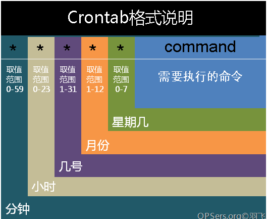

我已经在 crontab 上栽了很多次跟头了，我决定写个总结。

# 常用的命令

```bash
crontab -l # 显示计划任务脚本
crontab -e # 编辑计划任务
```

# 计划任务的格式



# 时间格式

```bash
* # 每个最小单元
/ # 时间步长，每隔多长时间执行 */10
- # 区间，如 4-9
, # 散列，如 4,9,10
```

# 几个例子

**crontab 最小支持的时间单位是 1 分钟，不支持每个多少秒执行一次**

```bash
# 每分钟执行
* * * * * cmd

# 每小时的15，45分钟执行
15,45 * * * * cmd

# 每个周一到周五，早上9点到下午6点之间，每隔15分钟喝一次水
*/15 9,18 * * 1-5 喝水
```

# 每个 X 秒执行

crontab 的默认最小执行周期是 1 分钟，如果想每隔多少秒执行一次，就需要一些特殊的手段。

## 每隔 5 秒

```bash
* * * * * for i in {1..12}; do /bin/cmd -arg1 ; sleep 5; done
```

##

## 每隔 15 秒

```bash
* * * * * /bin/cmd -arg1
* * * * * sleep 15; /bin/cmd -arg1
* * * * * sleep 30; /bin/cmd -arg1
* * * * * sleep 45; /bin/cmd -arg1
```

#

# 为什么 crontab 指定的脚本没有执行？

有以下可能原因

-   没有权限执行某个命令
-   某个命令不在环境变量中，无法找到对应命令

首先你必须测试一下，你的脚本不使用 crontab 能否正常执行。

大部分 crontab 执行不成功，都是因为环境变量的问题。

下面写个例子：

```bash
#!/bin/bash
now=`date`
msg=`opensips -V`
echo "$now $msg \n\n" >> /root/test.log
```

```bash
cd /root
sh test.sh
```

ctrontab -e 将 test.sh 加入 crontab 中

```bash
* * * * * sh /root/test.sh
```

centos crontab 的执行日志在/var/log/cron 中，可以查看执行日志。

我的机器是树莓派，没有这个文件，但是我是把执行输出到/root/test.log 中的，可以查看这个文件

可以看到虽然输入了事件，但是并没有输出 opensips 的版本

```bash
Mon  1 Jul 13:04:01 BST 2019


Mon  1 Jul 13:05:01 BST 2019
```

将$PATH 也加入输出，发现**Mon  1 Jul 13:10:01 BST 2019 /usr/bin:/bin，而 opensips 这个命令是位于/usr/local/sbin 下，所以无法找到执行文件，当然无法执行**

```bash
#!/bin/bash
now=`date`
msg=`opensips -V`
echo "$now $PATH $msg \n\n" >> /root/test.log
```

那还不好办吗？

在当前工作目录执行 echo $PATH， 然后在脚本里设置一个环境变量就能搞定

```bash
#!/bin/bash
PATH='/usr/local/sbin:/usr/local/bin:/usr/sbin:/usr/bin:/sbin:/bin'

now=`date`
msg=`opensips -V`
echo "$now $PATH $msg \n\n" >> /root/test.log
```

也可以使用 `journalctl -t CROND` 查看 crond 的日志

# 检查 crontab 是否运行

```bash
systemctl status crond

systemctl restart crond
```

# 在 alpine 中执行 crontab

alpine 中没有 systemctl， 需要启动 crond 的守护进程，否则程序定时任务是不会执行的

```bash
#!/bin/sh

# start cron
/usr/sbin/crond -f -l 8
```
