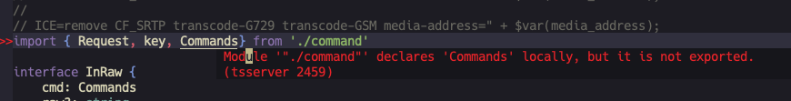

请注意，VIM的光标现在位于错误弹窗上了。光标只能左右移动，无法上线移动。 我的光标被困在了错误提示框中。

因为错误提示只有一行，所以无法上下移动。

一直以来，我并没有把错误提示框也看成一个窗口，所以我可能多次按了ctrl + w w, 然后光标跳转到了错误提示框上。

正常的错误提示框，当光标不在关键词上时，错误弹窗会自动关闭的。 但是由于我已经进入了错误弹窗里面。 所以除非按窗口切换的快捷键，我会始终困在这个错误窗口中。

我觉得，VIM实在是太博大精深了。很多感念性的理解不到位，就会越到很多困难。 这些困难会给人造成极大的挫折感。

能解决困难，则学到东西。

否则就只能放弃VIM, 回到VScode的怀抱中。

但是，我已经习惯了不使用鼠标的快捷编辑方式。

我只能学会解决并适应VIM， 并且接受VIM的所有挑战。